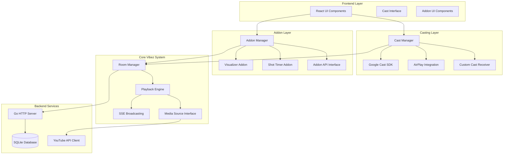

# Design Document: Advanced Casting and Addon System

## Overview

This design enhances Vibez with advanced casting capabilities (Google Cast and AirPlay) and introduces an extensible addon system. The solution maintains backward compatibility while adding powerful new features for collaborative music experiences.

The design follows a modular architecture where casting and addons operate as independent systems that integrate with the existing room/playback infrastructure. This approach ensures that existing functionality remains unchanged while providing rich extension points for future enhancements.

Key architectural principles:
- **Non-invasive Integration**: New features integrate without modifying core playback logic
- **Progressive Enhancement**: Features gracefully degrade when not available
- **Extensible Design**: Plugin architecture supports unlimited addon types
- **Real-time Synchronization**: All features maintain sub-200ms synchronization across devices

## Architecture

### System Components



### Integration Points

The new systems integrate with existing Vibez infrastructure through well-defined interfaces:

1. **Room Events**: Both casting and addons subscribe to room lifecycle events (join, leave, admin changes)
2. **Playback Events**: Systems receive notifications for play, pause, skip, and queue changes
3. **SSE Broadcasting**: Real-time updates flow through existing SSE infrastructure
4. **Media Source Interface**: Casting and addons access audio streams through standardized interface

## Components and Interfaces

### Cast Manager

The Cast Manager orchestrates all casting functionality and provides a unified interface for different casting protocols.

```typescript
interface CastManager {
  // Device Discovery
  discoverDevices(): Promise<CastDevice[]>
  getAvailableDevices(): CastDevice[]
  
  // Connection Management
  connectToDevice(deviceId: string): Promise<CastSession>
  disconnectFromDevice(deviceId: string): Promise<void>
  
  // Playback Control
  castMedia(mediaInfo: MediaInfo): Promise<void>
  updateQueue(queue: QueueItem[]): Promise<void>
  syncPlaybackState(state: PlaybackState): Promise<void>
  
  // Event Handling
  onDeviceAvailable(callback: (device: CastDevice) => void): void
  onSessionStateChange(callback: (session: CastSession) => void): void
  onCastError(callback: (error: CastError) => void): void
}

interface CastDevice {
  id: string
  name: string
  type: 'chromecast' | 'airplay' | 'dlna'
  capabilities: CastCapability[]
  isAvailable: boolean
}

interface CastSession {
  deviceId: string
  sessionId: string
  state: 'connecting' | 'connected' | 'disconnected' | 'error'
  mediaSession?: MediaSession
}
```

### Google Cast Integration

Google Cast integration uses the Cast Application Framework (CAF) for web senders and a custom receiver application.

**Web Sender Implementation:**
- Loads Google Cast SDK with `loadCastFramework=1` parameter
- Registers custom receiver application ID
- Handles cast button integration and browser right-click menu casting
- Manages media sessions and queue synchronization

**Custom Receiver Application:**
- HTML5 application hosted on HTTPS endpoint
- Displays queue information, current media, and addon content
- Handles custom messages from sender applications
- Supports background audio with visualizations

### AirPlay Integration

AirPlay integration leverages Safari's WebKit APIs and the Remote Playback API for cross-browser compatibility.

```typescript
interface AirPlayManager {
  // Availability Detection
  checkAvailability(): Promise<boolean>
  onAvailabilityChange(callback: (available: boolean) => void): void
  
  // Connection Management
  requestRemotePlayback(): Promise<void>
  cancelRemotePlayback(): Promise<void>
  
  // State Monitoring
  getRemotePlaybackState(): RemotePlaybackState
  onStateChange(callback: (state: RemotePlaybackState) => void): void
}

// Uses HTMLMediaElement.remote for AirPlay control
const videoElement = document.querySelector('video')
if (videoElement.remote) {
  videoElement.remote.watchAvailability((available) => {
    // Handle AirPlay availability
  })
}
```

### Addon Manager

The Addon Manager provides a plugin architecture that allows dynamic loading and management of addons.

```typescript
interface AddonManager {
  // Addon Lifecycle
  registerAddon(addon: Addon): Promise<void>
  unregisterAddon(addonId: string): Promise<void>
  enableAddon(addonId: string): Promise<void>
  disableAddon(addonId: string): Promise<void>
  
  // Addon Discovery
  getAvailableAddons(): AddonInfo[]
  getActiveAddons(): Addon[]
  
  // Event Broadcasting
  broadcastRoomEvent(event: RoomEvent): void
  broadcastPlaybackEvent(event: PlaybackEvent): void
  broadcastCastEvent(event: CastEvent): void
  
  // UI Integration
  renderAddonUI(containerId: string, addonId: string): void
  getAddonUIComponents(addonId: string): React.ComponentType[]
}

interface Addon {
  id: string
  name: string
  version: string
  description: string
  
  // Lifecycle Hooks
  onLoad(): Promise<void>
  onUnload(): Promise<void>
  onEnable(): Promise<void>
  onDisable(): Promise<void>
  
  // Event Handlers
  onRoomEvent?(event: RoomEvent): void
  onPlaybackEvent?(event: PlaybackEvent): void
  onCastEvent?(event: CastEvent): void
  
  // UI Components
  getUIComponents?(): AddonUIComponent[]
  getCastUIComponents?(): AddonCastUIComponent[]
}
```

### Visualizer Addon

The Visualizer Addon uses the Web Audio API to create real-time audio visualizations.

```typescript
interface VisualizerAddon extends Addon {
  // Visualization Control
  startVisualization(audioContext: AudioContext): void
  stopVisualization(): void
  setVisualizationStyle(style: VisualizationStyle): void
  
  // Audio Analysis
  connectAudioSource(source: MediaElementAudioSourceNode): void
  getFrequencyData(): Uint8Array
  getTimeDomainData(): Uint8Array
  
  // Rendering
  renderToCanvas(canvas: HTMLCanvasElement): void
  renderToCastDevice(castSession: CastSession): void
}

type VisualizationStyle = 
  | 'spectrum-bars'
  | 'waveform'
  | 'circular-spectrum'
  | 'particle-system'
  | 'frequency-rings'
```

**Audio Analysis Pipeline:**
1. Create AudioContext from media element
2. Connect AnalyserNode for frequency/time domain analysis
3. Use requestAnimationFrame for smooth 60fps rendering
4. Apply FFT analysis for spectrum visualization
5. Render to both local canvas and cast device

### Shot Timer Addon

The Shot Timer Addon provides drinking game functionality integrated with the music experience.

```typescript
interface ShotTimerAddon extends Addon {
  // Timer Management
  createTimer(duration: number, label?: string): TimerId
  startTimer(timerId: TimerId): void
  pauseTimer(timerId: TimerId): void
  stopTimer(timerId: TimerId): void
  
  // Timer Configuration
  setTimerInterval(interval: number): void
  setNotificationStyle(style: NotificationStyle): void
  
  // Event Handling
  onTimerExpired(callback: (timerId: TimerId) => void): void
  onTimerTick(callback: (timerId: TimerId, remaining: number) => void): void
}

interface TimerConfig {
  duration: number // milliseconds
  label: string
  autoStart: boolean
  repeatCount?: number
  notificationStyle: NotificationStyle
}

type NotificationStyle = {
  visual: 'flash' | 'pulse' | 'shake' | 'bounce'
  audio: 'beep' | 'chime' | 'horn' | 'custom'
  intensity: 'subtle' | 'normal' | 'intense'
}
```

## Data Models

### Cast-Related Models

```typescript
// Extends existing Vibez room model
interface Room {
  // ... existing fields
  castingEnabled: boolean
  activeCastSession?: CastSession
  castDevicePreferences: CastDevicePreference[]
}

interface CastDevicePreference {
  deviceId: string
  deviceName: string
  deviceType: CastDeviceType
  isPreferred: boolean
  lastUsed: Date
}

interface CastSession {
  id: string
  roomId: string
  deviceId: string
  deviceName: string
  deviceType: CastDeviceType
  state: CastSessionState
  startedAt: Date
  lastSyncAt: Date
  mediaSessionId?: string
}

type CastDeviceType = 'chromecast' | 'airplay' | 'dlna'
type CastSessionState = 'connecting' | 'connected' | 'syncing' | 'error' | 'disconnected'
```

### Addon-Related Models

```typescript
// Extends existing room model for addon support
interface Room {
  // ... existing fields
  enabledAddons: string[] // addon IDs
  addonConfigurations: Record<string, AddonConfig>
}

interface AddonConfig {
  addonId: string
  enabled: boolean
  settings: Record<string, any>
  permissions: AddonPermission[]
}

interface AddonPermission {
  type: 'audio-access' | 'cast-control' | 'room-events' | 'user-data'
  granted: boolean
  grantedAt: Date
}

// Visualizer-specific models
interface VisualizationSettings {
  style: VisualizationStyle
  colorScheme: ColorScheme
  sensitivity: number // 0.1 to 2.0
  smoothing: number // 0.0 to 1.0
  fftSize: number // 256, 512, 1024, 2048
}

// Shot Timer-specific models
interface TimerInstance {
  id: string
  roomId: string
  duration: number
  remaining: number
  label: string
  state: 'created' | 'running' | 'paused' | 'expired'
  createdBy: string // user ID
  createdAt: Date
  startedAt?: Date
  expiredAt?: Date
}
```

### Enhanced Media Models

```typescript
// Extends existing media source interface
interface MediaSource {
  // ... existing methods
  getAudioStream(): Promise<MediaStream>
  getAudioContext(): Promise<AudioContext>
  supportsVisualization(): boolean
  supportsCasting(): boolean
}

// Enhanced playback state for synchronization
interface PlaybackState {
  // ... existing fields
  castSessionId?: string
  visualizationActive: boolean
  activeAddons: string[]
  syncTimestamp: number // high-precision timestamp
  audioAnalysisData?: AudioAnalysisData
}

interface AudioAnalysisData {
  frequencyData: number[] // normalized 0-1
  timeDomainData: number[] // normalized -1 to 1
  volume: number // RMS volume 0-1
  pitch?: number // fundamental frequency in Hz
  tempo?: number // BPM if detectable
}
```

### Database Schema Extensions

The existing SQLite schema will be extended with new tables for casting and addon functionality:

```sql
-- Cast sessions table
CREATE TABLE cast_sessions (
  id TEXT PRIMARY KEY,
  room_id TEXT NOT NULL,
  device_id TEXT NOT NULL,
  device_name TEXT NOT NULL,
  device_type TEXT NOT NULL,
  state TEXT NOT NULL,
  started_at DATETIME NOT NULL,
  last_sync_at DATETIME,
  media_session_id TEXT,
  FOREIGN KEY (room_id) REFERENCES rooms(id)
);

-- Addon configurations table
CREATE TABLE addon_configs (
  id TEXT PRIMARY KEY,
  room_id TEXT NOT NULL,
  addon_id TEXT NOT NULL,
  enabled BOOLEAN NOT NULL DEFAULT FALSE,
  settings TEXT, -- JSON blob
  created_at DATETIME NOT NULL,
  updated_at DATETIME NOT NULL,
  FOREIGN KEY (room_id) REFERENCES rooms(id)
);

-- Timer instances table (for shot timer addon)
CREATE TABLE timer_instances (
  id TEXT PRIMARY KEY,
  room_id TEXT NOT NULL,
  duration INTEGER NOT NULL,
  remaining INTEGER NOT NULL,
  label TEXT,
  state TEXT NOT NULL,
  created_by TEXT NOT NULL,
  created_at DATETIME NOT NULL,
  started_at DATETIME,
  expired_at DATETIME,
  FOREIGN KEY (room_id) REFERENCES rooms(id)
);
```

## Correctness Properties

*A property is a characteristic or behavior that should hold true across all valid executions of a system—essentially, a formal statement about what the system should do. Properties serve as the bridge between human-readable specifications and machine-verifiable correctness guarantees.*

Based on the prework analysis and property reflection to eliminate redundancy, the following properties ensure the correctness of the advanced casting and addon system:

### Property 1: Casting Device Discovery Consistency
*For any* network configuration with available casting devices, when device discovery is initiated, the system should return all available devices of supported types (Google Cast, AirPlay) with accurate device information.
**Validates: Requirements 1.1, 2.1**

### Property 2: Casting Connection Establishment
*For any* available casting device, when selected for connection, the system should successfully establish a connection and begin streaming the current media content within the connection timeout period.
**Validates: Requirements 1.2, 2.2**

### Property 3: Cast UI Content Consistency
*For any* active casting session, the cast device UI should display all required media information (title, artist, artwork, queue) that matches the current playback state on the sender device.
**Validates: Requirements 1.3, 3.1, 3.2**

### Property 4: Playback Synchronization Accuracy
*For any* casting session, playback synchronization between sender and receiver devices should remain within 100ms, and queue advances should update cast devices within 500ms.
**Validates: Requirements 1.4, 2.3, 8.1, 8.3**

### Property 5: Graceful Disconnection Handling
*For any* active casting session, when disconnection occurs (planned or unplanned), the system should gracefully handle cleanup, attempt reconnection where appropriate, and notify all participants of the state change.
**Validates: Requirements 1.5, 2.5**

### Property 6: Mid-Session Synchronization
*For any* participant joining during active casting, they should receive the current synchronized playback state and be able to participate in the session without disrupting other participants.
**Validates: Requirements 2.4, 8.4**

### Property 7: Cast UI Update Responsiveness
*For any* playback state change (skip, pause, play, vote), the cast UI should update within the specified time limits (500ms for media changes, 200ms for voting updates) to maintain real-time synchronization.
**Validates: Requirements 3.3, 3.5, 8.5**

### Property 8: Cast UI Fallback Display
*For any* media content without video or during audio-only playback, the cast UI should display appropriate fallback content (visualizations, album artwork, or ambient animations).
**Validates: Requirements 3.4, 5.5**

### Property 9: Addon Lifecycle Management
*For any* valid addon, the addon manager should successfully register, load, enable, and disable the addon through the standardized interface while maintaining system stability.
**Validates: Requirements 4.1, 4.2, 4.3**

### Property 10: Addon Failure Isolation
*For any* addon failure or crash, the addon manager should isolate the failure, continue operating other addons, and maintain core system functionality without degradation.
**Validates: Requirements 4.4**

### Property 11: Addon Event Hook Consistency
*For any* room, playback, or cast event, all registered addons should receive the event through their hooks with consistent event data and timing.
**Validates: Requirements 4.5, 8.2**

### Property 12: Visualizer Audio Responsiveness
*For any* audio input with varying frequency and amplitude characteristics, the visualizer should generate visualizations that accurately reflect the audio characteristics in real-time.
**Validates: Requirements 5.1, 5.2**

### Property 13: Visualizer Dual Rendering
*For any* active casting session with visualizer enabled, visualizations should render consistently on both the web interface and cast device with synchronized timing.
**Validates: Requirements 5.3**

### Property 14: Visualizer Style Switching
*For any* active visualizer session, users should be able to cycle through different visualization styles with immediate visual feedback and no interruption to audio playback.
**Validates: Requirements 5.4**

### Property 15: Timer Functionality Accuracy
*For any* shot timer configuration, the timer should count down accurately, trigger notifications at specified intervals, and provide prominent expiration notifications to all participants.
**Validates: Requirements 6.2, 6.3**

### Property 16: Concurrent Timer Management
*For any* set of multiple active timers with different durations, each timer should operate independently without interference, maintaining accurate countdown and notifications.
**Validates: Requirements 6.4**

### Property 17: Timer Cast Integration
*For any* active casting session with shot timer enabled, timer information should display consistently on both web interface and cast devices with synchronized updates.
**Validates: Requirements 6.5**

### Property 18: Media Source Abstraction
*For any* media source implementation (YouTube, future Spotify/SoundCloud), the casting system and addons should function identically without modification to casting or addon code.
**Validates: Requirements 7.1, 7.2, 7.3**

### Property 19: Media Source Audio Stream Consistency
*For any* media source, the audio stream provided to visualizers and casting systems should follow the standardized format and provide consistent metadata access.
**Validates: Requirements 7.5**

### Property 20: Extensible Media Source Interface
*For any* new media source with source-specific features, the interface should support additional metadata properties without breaking existing functionality or requiring changes to dependent systems.
**Validates: Requirements 7.4**

### Property 21: Backward Compatibility Preservation
*For any* existing Vibez functionality (Host Mode, Follower Mode, API endpoints), the system should operate identically to the pre-enhancement implementation when casting and addons are disabled.
**Validates: Requirements 9.1, 9.2, 9.4**

### Property 22: Legacy Client Graceful Degradation
*For any* legacy client connection, the system should provide core functionality while gracefully degrading enhanced features without causing errors or performance issues.
**Validates: Requirements 9.3**

### Property 23: Performance Impact Neutrality
*For any* room session created without casting or addons enabled, system performance characteristics should remain equivalent to the current implementation.
**Validates: Requirements 9.5**

### Property 24: Configuration Persistence and Management
*For any* room configuration with addon and casting preferences, the settings should persist across sessions and provide real-time management capabilities during active sessions.
**Validates: Requirements 10.1, 10.2, 10.3**

### Property 25: Resource Management and Prioritization
*For any* system resource constraint scenario, administrators should be able to prioritize core features over addons, and the system should provide clear conflict resolution guidance.
**Validates: Requirements 10.4, 10.5**

## Error Handling

### Casting Error Scenarios

**Network Connectivity Issues:**
- Implement exponential backoff for reconnection attempts
- Provide clear user feedback about connection status
- Gracefully fallback to web-only playback when casting fails
- Cache last known device state for quick reconnection

**Device Compatibility Problems:**
- Validate device capabilities before attempting connection
- Provide fallback options for unsupported features
- Display clear error messages for incompatible devices
- Maintain device compatibility database for known issues

**Synchronization Failures:**
- Implement drift detection and correction algorithms
- Provide manual sync controls for administrators
- Log synchronization metrics for debugging
- Fallback to approximate synchronization when precise sync fails

### Addon Error Scenarios

**Addon Loading Failures:**
- Validate addon compatibility before loading
- Provide detailed error messages for loading failures
- Implement safe mode operation without problematic addons
- Maintain addon dependency resolution

**Runtime Addon Errors:**
- Implement addon sandboxing to prevent system crashes
- Provide addon error reporting and logging
- Allow hot-swapping of failed addons
- Maintain addon state recovery mechanisms

**Resource Exhaustion:**
- Implement addon resource monitoring and limits
- Provide graceful degradation when resources are limited
- Allow administrators to disable resource-intensive addons
- Implement addon priority systems for resource allocation

### Audio Processing Errors

**Web Audio API Failures:**
- Detect and handle browser audio API limitations
- Provide fallback visualizations when audio analysis fails
- Implement cross-browser compatibility layers
- Handle audio permission and access errors gracefully

**Visualizer Rendering Issues:**
- Implement canvas fallbacks for WebGL failures
- Handle high-DPI display rendering correctly
- Provide performance-optimized rendering modes
- Detect and adapt to device performance capabilities

## Testing Strategy

### Dual Testing Approach

The testing strategy employs both unit testing and property-based testing to ensure comprehensive coverage:

**Unit Tests:**
- Focus on specific examples, edge cases, and error conditions
- Test integration points between components
- Verify specific casting protocol implementations
- Test addon lifecycle management scenarios
- Validate UI component behavior and rendering

**Property-Based Tests:**
- Verify universal properties across all inputs using randomized testing
- Test casting synchronization across various network conditions
- Validate addon behavior with different configurations
- Test system behavior under resource constraints
- Verify backward compatibility across different client versions

### Property-Based Testing Configuration

**Testing Framework:** Use `fast-check` for TypeScript/JavaScript property-based testing
**Test Configuration:** Minimum 100 iterations per property test
**Test Tagging:** Each property test references its design document property

Example test structure:
```typescript
// Feature: advanced-casting-and-addons, Property 1: Casting Device Discovery Consistency
fc.test('casting device discovery returns all available devices', 
  fc.record({
    networkDevices: fc.array(fc.castDevice()),
    networkConfig: fc.networkConfiguration()
  }),
  async ({ networkDevices, networkConfig }) => {
    // Test implementation
  },
  { numRuns: 100 }
)
```

### Integration Testing

**Cast Integration Tests:**
- Test Google Cast SDK integration with mock receivers
- Validate AirPlay functionality across Safari and other browsers
- Test cross-device synchronization scenarios
- Verify custom receiver application behavior

**Addon Integration Tests:**
- Test addon loading and unloading scenarios
- Validate addon event handling and communication
- Test addon UI integration with main application
- Verify addon resource management and isolation

**End-to-End Testing:**
- Test complete casting workflows from device discovery to playback
- Validate addon functionality during active casting sessions
- Test system behavior with multiple concurrent users and addons
- Verify performance under realistic load conditions

### Performance Testing

**Synchronization Performance:**
- Measure and validate sub-100ms casting synchronization
- Test addon event propagation timing (sub-200ms requirement)
- Validate UI update responsiveness during high-frequency events
- Monitor resource usage during intensive addon operations

**Scalability Testing:**
- Test system behavior with multiple concurrent casting sessions
- Validate addon performance with large numbers of active addons
- Test network bandwidth usage during casting and visualization
- Monitor memory usage and cleanup during long-running sessions