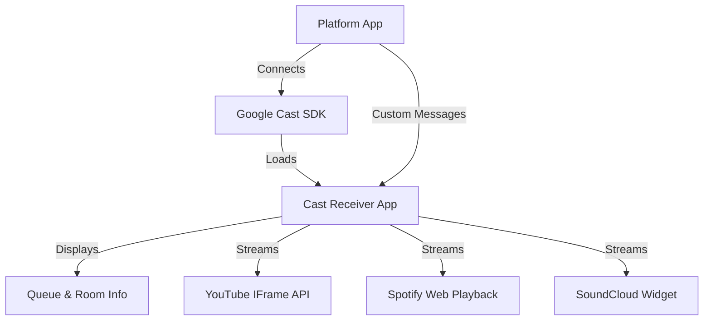

# Vibez Cast Development Guide

## Overview

The Vibez casting system consists of two main parts:
1.  **Sender (Platform App)**: Discovers devices and initiates sessions (`apps/platform`).
2.  **Receiver (Cast App)**: A standalone React application running on the Chromecast device (`apps/cast`).

## Architecture



### Queue-Based Casting Architecture
- **No Direct YouTube Casting**: Removed direct YouTube URL casting
- **Custom Message Protocol**: Uses `urn:x-cast:com.vibez.cast` namespace for all communication
- **Playback State Sync**: Real-time synchronization of current song, queue, and room info
- **Multi-Provider Support**: Handles YouTube, Spotify, and SoundCloud through unified interface

### Standalone Receiver App (`apps/cast`)
- Built with **Vite 6** + **React 19** + **Tailwind 4**.
- Uses `chromecast-caf-receiver` SDK.
- Served at `/casting/receiver/`.
- **Entrypoint**: `apps/cast/src/App.tsx`.
- **Assets**: Bundled into `dist` and served statically.

## Custom Message Protocol

### Message Types
All messages use the `urn:x-cast:com.vibez.cast` namespace:

1. **updatePlayback**: Initial song and room state
2. **syncPlayback**: Real-time playback synchronization
3. **updateQueue**: Queue updates with upcoming songs
4. **updateRoomInfo**: Room name and participant count

### Message Format
```typescript
{
  action: 'updatePlayback' | 'syncPlayback' | 'updateQueue' | 'updateRoomInfo',
  currentSong?: Song,
  isPlaying?: boolean,
  positionMs?: number,
  queue?: Song[],
  roomInfo?: { name: string, participantCount: number },
  timestamp: number
}
```

## Development

### Running Locally
To run the full stack including the Cast Receiver with SSR:

```bash
make local-dev
```

This starts:
- **Backend**: `localhost:8080`
- **Platform**: `localhost:3000` (SSR-enabled)
- **Cast Receiver**: `localhost:3001` (SSR-enabled)
- **Caddy Proxy**: `https://localhost` (Routes `/casting/receiver/*` to `localhost:3001`)

### Testing the Receiver
You can test the receiver UI in your browser without a Chromecast device:
1. Run `make local-dev`
2. Open **[https://localhost/casting/receiver/](https://localhost/casting/receiver/)**
3. The app loads with SSR for faster initial rendering and waits for a Cast session

### SSR Development
Both applications now support server-side rendering:
- **Hot Module Replacement**: Works with SSR during development
- **Fast Refresh**: React components update without losing state
- **Error Handling**: SSR errors are handled gracefully with fallbacks

### Debugging on Chromecast
1. Register your **Custom Receiver** in the Google Cast SDK Console.
2. Point the Custom Receiver URL to your publicly accessible dev tunnel (e.g., using `ngrok` or a staging deploy).
    - URL: `https://your-domain.com/casting/receiver/`
3. Use Chrome Remote Debugger (`chrome://inspect`) to inspect the web view running on the Chromecast.

## Deployment

The Cast Receiver is deployed as part of the frontend Docker image with SSR support.

- **Dockerfile**: Builds both `apps/platform` and `apps/cast` with SSR
- **SSR Servers**: Both apps run their own SSR servers in production
- **Caddy**: Routes traffic:
    - `https://vibez.io/` -> Platform App (SSR)
    - `https://vibez.io/casting/receiver/*` -> Cast Receiver App (SSR)

## Key Features
- **Multi-Provider Support**: YouTube, Spotify, and SoundCloud via unified interface
- **Queue-Based Casting**: Shows current song and upcoming queue items
- **Real-time Sync**: Connects to platform via custom messages for room state
- **Room Display**: Shows room name and participant count
- **SSR Performance**: Fast initial loading with server-side rendering
- **Branding**: Full custom UI matching Vibez design system with dark mode support

## Troubleshooting

### Black Screen Issues
- **Check Message Namespace**: Ensure sender uses `urn:x-cast:com.vibez.cast`
- **Verify Custom Data**: Check that song data is properly formatted in messages
- **Console Logs**: Use Chrome Remote Debugger to check receiver console
- **Token Passing**: Verify Spotify/SoundCloud tokens are included in customData

### Common Fixes
1. **No Content**: Ensure `updatePlayback` message is sent after receiver loads
2. **Wrong Namespace**: All custom messages must use `urn:x-cast:com.vibez.cast`
3. **Missing Song Data**: Check that currentSong object has required fields (title, artist, sourceType, sourceId)
4. **Player Not Showing**: Verify sourceType matches player component conditions