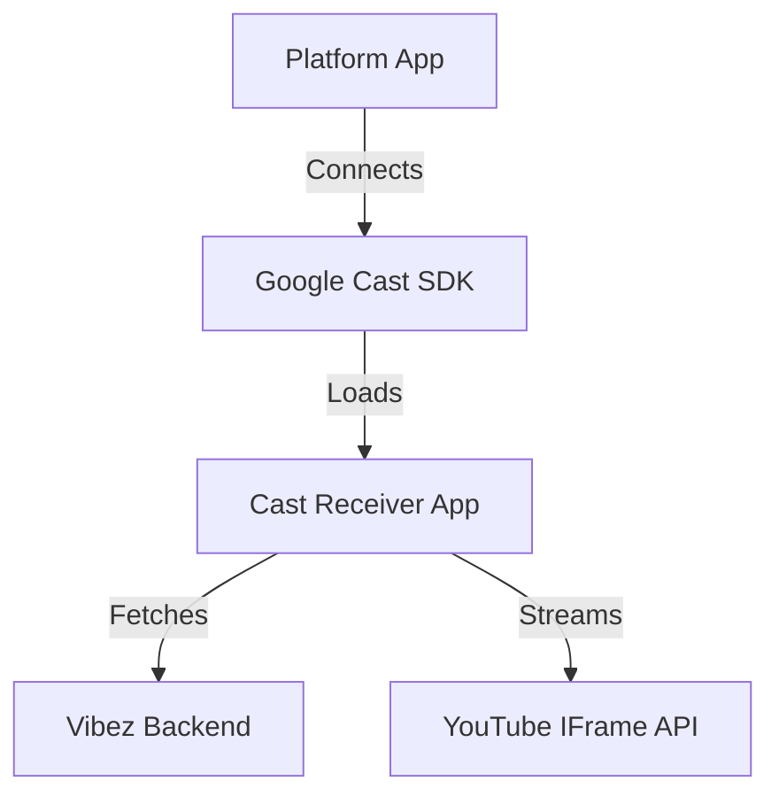

# Vibez Cast Development Guide

## Overview

The Vibez casting system consists of two main parts:
1.  **Sender (Platform App)**: Discovers devices and initiates sessions (`apps/platform`).
2.  **Receiver (Cast App)**: A standalone React application running on the Chromecast device (`apps/cast`).

## Architecture



### Standalone Receiver App (`apps/cast`)
- Built with **Vite 6** + **React 19** + **Tailwind 4**.
- Uses `chromecast-caf-receiver` SDK.
- Served at `/casting/receiver/`.
- **Entrypoint**: `apps/cast/src/App.tsx`.
- **Assets**: Bundled into `dist` and served statically.

## Development

### Running Locally
To run the full stack including the Cast Receiver:

```bash
make local-dev
```

This starts:
- **Backend**: `localhost:8080`
- **Platform**: `localhost:3000`
- **Cast Receiver**: `localhost:3001`
- **Caddy Proxy**: `https://localhost` (Routes `/casting/receiver/*` to `localhost:3001`)

### Testing the Receiver
You can test the receiver UI in your browser without a Chromecast device:
1. Run `make local-dev`.
2. Open **[https://localhost/casting/receiver/](https://localhost/casting/receiver/)**.
3. The app simulates a session (if configured to do so in dev mode) or waits for a Cast session.

### Debugging on Chromecast
1. Register your **Custom Receiver** in the Google Cast SDK Console.
2. Point the Custom Receiver URL to your publicly accessible dev tunnel (e.g., using `ngrok` or a staging deploy).
    - URL: `https://your-domain.com/casting/receiver/`
3. Use Chrome Remote Debugger (`chrome://inspect`) to inspect the web view running on the Chromecast.

## Deployment

The Cast Receiver is deployed as part of the frontend Docker image.

- **Dockerfile**: Builds `apps/cast` and copies artifacts to `/srv/cast-app`.
- **Caddy**: Routes traffic:
    - `https://vibez.io/` -> Platform App
    - `https://vibez.io/casting/receiver/*` -> Cast Receiver App

## Key Features
- **YouTube Support**: embeddings via `react-player` / custom iframe.
- **Real-time Sync**: Connects to backend SSE for room state.
- **Queue Display**: Shows upcoming songs.
- **Branding**: Full custom UI matching Vibez design system.