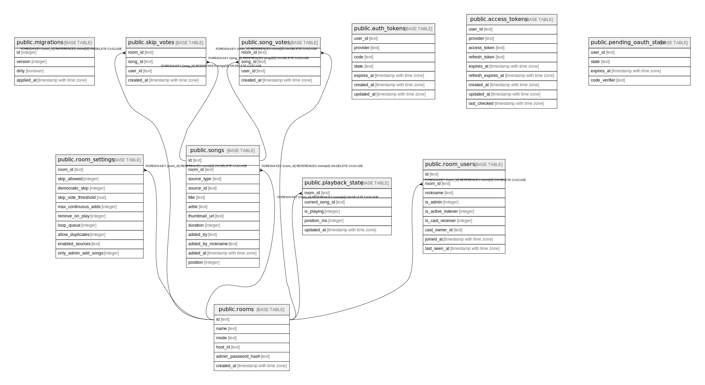

# vibes_docs_20260707232657

## Tables

| Name | Columns | Comment | Type |
| ---- | ------- | ------- | ---- |
| [public.migrations](public.migrations.md) | 4 |  | BASE TABLE |
| [public.rooms](public.rooms.md) | 6 |  | BASE TABLE |
| [public.room_settings](public.room_settings.md) | 10 |  | BASE TABLE |
| [public.songs](public.songs.md) | 12 |  | BASE TABLE |
| [public.playback_state](public.playback_state.md) | 5 |  | BASE TABLE |
| [public.room_users](public.room_users.md) | 9 |  | BASE TABLE |
| [public.skip_votes](public.skip_votes.md) | 4 |  | BASE TABLE |
| [public.song_votes](public.song_votes.md) | 4 |  | BASE TABLE |
| [public.auth_tokens](public.auth_tokens.md) | 7 |  | BASE TABLE |
| [public.access_tokens](public.access_tokens.md) | 9 |  | BASE TABLE |
| [public.pending_oauth_state](public.pending_oauth_state.md) | 4 |  | BASE TABLE |

## Stored procedures and functions

| Name | ReturnType | Arguments | Type |
| ---- | ------- | ------- | ---- |
| public.digest | bytea | text, text | FUNCTION |
| public.digest | bytea | bytea, text | FUNCTION |
| public.hmac | bytea | text, text, text | FUNCTION |
| public.hmac | bytea | bytea, bytea, text | FUNCTION |
| public.crypt | text | text, text | FUNCTION |
| public.gen_salt | text | text | FUNCTION |
| public.gen_salt | text | text, integer | FUNCTION |
| public.encrypt | bytea | bytea, bytea, text | FUNCTION |
| public.decrypt | bytea | bytea, bytea, text | FUNCTION |
| public.encrypt_iv | bytea | bytea, bytea, bytea, text | FUNCTION |
| public.decrypt_iv | bytea | bytea, bytea, bytea, text | FUNCTION |
| public.gen_random_bytes | bytea | integer | FUNCTION |
| public.gen_random_uuid | uuid |  | FUNCTION |
| public.pgp_sym_encrypt | bytea | text, text | FUNCTION |
| public.pgp_sym_encrypt_bytea | bytea | bytea, text | FUNCTION |
| public.pgp_sym_encrypt | bytea | text, text, text | FUNCTION |
| public.pgp_sym_encrypt_bytea | bytea | bytea, text, text | FUNCTION |
| public.pgp_sym_decrypt | text | bytea, text | FUNCTION |
| public.pgp_sym_decrypt_bytea | bytea | bytea, text | FUNCTION |
| public.pgp_sym_decrypt | text | bytea, text, text | FUNCTION |
| public.pgp_sym_decrypt_bytea | bytea | bytea, text, text | FUNCTION |
| public.pgp_pub_encrypt | bytea | text, bytea | FUNCTION |
| public.pgp_pub_encrypt_bytea | bytea | bytea, bytea | FUNCTION |
| public.pgp_pub_encrypt | bytea | text, bytea, text | FUNCTION |
| public.pgp_pub_encrypt_bytea | bytea | bytea, bytea, text | FUNCTION |
| public.pgp_pub_decrypt | text | bytea, bytea | FUNCTION |
| public.pgp_pub_decrypt_bytea | bytea | bytea, bytea | FUNCTION |
| public.pgp_pub_decrypt | text | bytea, bytea, text | FUNCTION |
| public.pgp_pub_decrypt_bytea | bytea | bytea, bytea, text | FUNCTION |
| public.pgp_pub_decrypt | text | bytea, bytea, text, text | FUNCTION |
| public.pgp_pub_decrypt_bytea | bytea | bytea, bytea, text, text | FUNCTION |
| public.pgp_key_id | text | bytea | FUNCTION |
| public.armor | text | bytea | FUNCTION |
| public.armor | text | bytea, text[], text[] | FUNCTION |
| public.dearmor | bytea | text | FUNCTION |
| public.pgp_armor_headers | record | text, OUT key text, OUT value text | FUNCTION |
| public.fips_mode | bool |  | FUNCTION |

## Relations

---

> Generated by [tbls](https://github.com/k1LoW/tbls)
