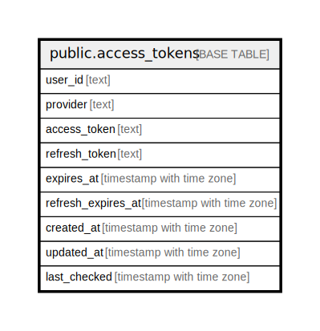

# public.access_tokens

## Columns

| Name | Type | Default | Nullable | Children | Parents | Comment |
| ---- | ---- | ------- | -------- | -------- | ------- | ------- |
| user_id | text |  | false |  |  |  |
| provider | text |  | false |  |  |  |
| access_token | text |  | false |  |  |  |
| refresh_token | text |  | false |  |  |  |
| expires_at | timestamp with time zone |  | false |  |  |  |
| refresh_expires_at | timestamp with time zone |  | false |  |  |  |
| created_at | timestamp with time zone | now() | true |  |  |  |
| updated_at | timestamp with time zone | now() | true |  |  |  |
| last_checked | timestamp with time zone |  | true |  |  |  |

## Constraints

| Name | Type | Definition |
| ---- | ---- | ---------- |
| access_tokens_access_token_not_null | n | NOT NULL access_token |
| access_tokens_expires_at_not_null | n | NOT NULL expires_at |
| access_tokens_provider_not_null | n | NOT NULL provider |
| access_tokens_refresh_expires_at_not_null | n | NOT NULL refresh_expires_at |
| access_tokens_refresh_token_not_null | n | NOT NULL refresh_token |
| access_tokens_user_id_not_null | n | NOT NULL user_id |
| access_tokens_pkey | PRIMARY KEY | PRIMARY KEY (user_id, provider) |

## Indexes

| Name | Definition |
| ---- | ---------- |
| access_tokens_pkey | CREATE UNIQUE INDEX access_tokens_pkey ON public.access_tokens USING btree (user_id, provider) |

## Relations

---

> Generated by [tbls](https://github.com/k1LoW/tbls)
