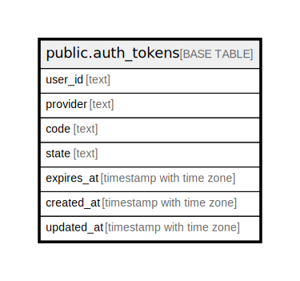

# public.auth_tokens

## Columns

| Name | Type | Default | Nullable | Children | Parents | Comment |
| ---- | ---- | ------- | -------- | -------- | ------- | ------- |
| user_id | text |  | false |  |  |  |
| provider | text |  | false |  |  |  |
| code | text |  | false |  |  |  |
| state | text |  | false |  |  |  |
| expires_at | timestamp with time zone |  | false |  |  |  |
| created_at | timestamp with time zone | now() | true |  |  |  |
| updated_at | timestamp with time zone | now() | true |  |  |  |

## Constraints

| Name | Type | Definition |
| ---- | ---- | ---------- |
| auth_tokens_code_not_null | n | NOT NULL code |
| auth_tokens_expires_at_not_null | n | NOT NULL expires_at |
| auth_tokens_provider_not_null | n | NOT NULL provider |
| auth_tokens_state_not_null | n | NOT NULL state |
| auth_tokens_user_id_not_null | n | NOT NULL user_id |
| auth_tokens_pkey | PRIMARY KEY | PRIMARY KEY (user_id, provider) |

## Indexes

| Name | Definition |
| ---- | ---------- |
| auth_tokens_pkey | CREATE UNIQUE INDEX auth_tokens_pkey ON public.auth_tokens USING btree (user_id, provider) |

## Relations

---

> Generated by [tbls](https://github.com/k1LoW/tbls)
