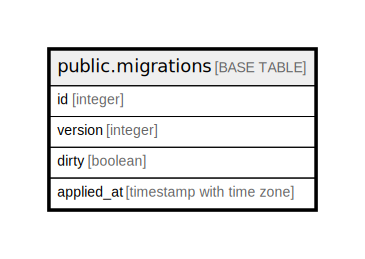

# public.migrations

## Columns

| Name | Type | Default | Nullable | Children | Parents | Comment |
| ---- | ---- | ------- | -------- | -------- | ------- | ------- |
| id | integer |  | false |  |  |  |
| version | integer |  | false |  |  |  |
| dirty | boolean | false | false |  |  |  |
| applied_at | timestamp with time zone | now() | true |  |  |  |

## Constraints

| Name | Type | Definition |
| ---- | ---- | ---------- |
| migrations_dirty_not_null | n | NOT NULL dirty |
| migrations_id_not_null | n | NOT NULL id |
| migrations_version_not_null | n | NOT NULL version |
| migrations_pkey | PRIMARY KEY | PRIMARY KEY (id) |

## Indexes

| Name | Definition |
| ---- | ---------- |
| migrations_pkey | CREATE UNIQUE INDEX migrations_pkey ON public.migrations USING btree (id) |

## Relations

---

> Generated by [tbls](https://github.com/k1LoW/tbls)
