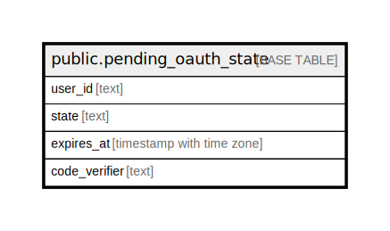

# public.pending_oauth_state

## Columns

| Name | Type | Default | Nullable | Children | Parents | Comment |
| ---- | ---- | ------- | -------- | -------- | ------- | ------- |
| user_id | text |  | false |  |  |  |
| state | text |  | false |  |  |  |
| expires_at | timestamp with time zone |  | false |  |  |  |
| code_verifier | text |  | true |  |  |  |

## Constraints

| Name | Type | Definition |
| ---- | ---- | ---------- |
| pending_oauth_state_expires_at_not_null | n | NOT NULL expires_at |
| pending_oauth_state_state_not_null | n | NOT NULL state |
| pending_oauth_state_user_id_not_null | n | NOT NULL user_id |
| pending_oauth_state_pkey | PRIMARY KEY | PRIMARY KEY (user_id, state) |

## Indexes

| Name | Definition |
| ---- | ---------- |
| pending_oauth_state_pkey | CREATE UNIQUE INDEX pending_oauth_state_pkey ON public.pending_oauth_state USING btree (user_id, state) |

## Relations

---

> Generated by [tbls](https://github.com/k1LoW/tbls)
