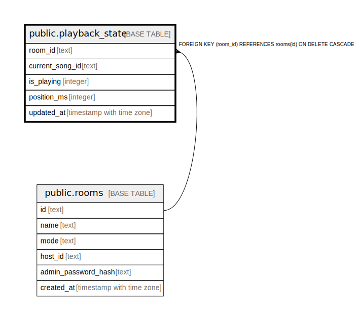

# public.playback_state

## Columns

| Name | Type | Default | Nullable | Children | Parents | Comment |
| ---- | ---- | ------- | -------- | -------- | ------- | ------- |
| room_id | text |  | false |  | [public.rooms](public.rooms.md) |  |
| current_song_id | text |  | true |  |  |  |
| is_playing | integer | 0 | true |  |  |  |
| position_ms | integer | 0 | true |  |  |  |
| updated_at | timestamp with time zone | now() | true |  |  |  |

## Constraints

| Name | Type | Definition |
| ---- | ---- | ---------- |
| playback_state_room_id_not_null | n | NOT NULL room_id |
| playback_state_room_id_fkey | FOREIGN KEY | FOREIGN KEY (room_id) REFERENCES rooms(id) ON DELETE CASCADE |
| playback_state_pkey | PRIMARY KEY | PRIMARY KEY (room_id) |

## Indexes

| Name | Definition |
| ---- | ---------- |
| playback_state_pkey | CREATE UNIQUE INDEX playback_state_pkey ON public.playback_state USING btree (room_id) |

## Relations

---

> Generated by [tbls](https://github.com/k1LoW/tbls)
