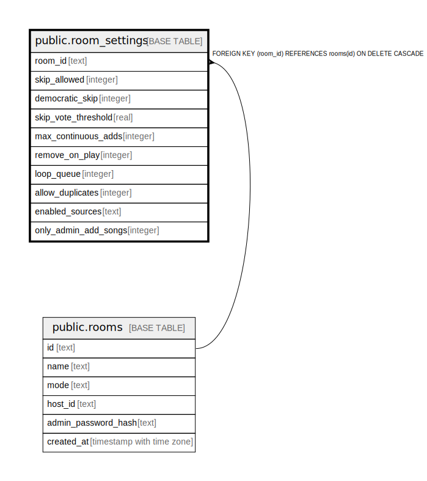

# public.room_settings

## Columns

| Name | Type | Default | Nullable | Children | Parents | Comment |
| ---- | ---- | ------- | -------- | -------- | ------- | ------- |
| room_id | text |  | false |  | [public.rooms](public.rooms.md) |  |
| skip_allowed | integer | 1 | false |  |  |  |
| democratic_skip | integer | 1 | false |  |  |  |
| skip_vote_threshold | real | 0.5 | false |  |  |  |
| max_continuous_adds | integer | 3 | false |  |  |  |
| remove_on_play | integer | 1 | false |  |  |  |
| loop_queue | integer | 0 | false |  |  |  |
| allow_duplicates | integer | 0 | false |  |  |  |
| enabled_sources | text | 'youtube,spotify,soundcloud'::text | false |  |  |  |
| only_admin_add_songs | integer | 0 | false |  |  |  |

## Constraints

| Name | Type | Definition |
| ---- | ---- | ---------- |
| room_settings_allow_duplicates_not_null | n | NOT NULL allow_duplicates |
| room_settings_democratic_skip_not_null | n | NOT NULL democratic_skip |
| room_settings_enabled_sources_not_null | n | NOT NULL enabled_sources |
| room_settings_loop_queue_not_null | n | NOT NULL loop_queue |
| room_settings_max_continuous_adds_not_null | n | NOT NULL max_continuous_adds |
| room_settings_only_admin_add_songs_not_null | n | NOT NULL only_admin_add_songs |
| room_settings_remove_on_play_not_null | n | NOT NULL remove_on_play |
| room_settings_room_id_not_null | n | NOT NULL room_id |
| room_settings_skip_allowed_not_null | n | NOT NULL skip_allowed |
| room_settings_skip_vote_threshold_not_null | n | NOT NULL skip_vote_threshold |
| room_settings_room_id_fkey | FOREIGN KEY | FOREIGN KEY (room_id) REFERENCES rooms(id) ON DELETE CASCADE |
| room_settings_pkey | PRIMARY KEY | PRIMARY KEY (room_id) |

## Indexes

| Name | Definition |
| ---- | ---------- |
| room_settings_pkey | CREATE UNIQUE INDEX room_settings_pkey ON public.room_settings USING btree (room_id) |

## Relations

---

> Generated by [tbls](https://github.com/k1LoW/tbls)
