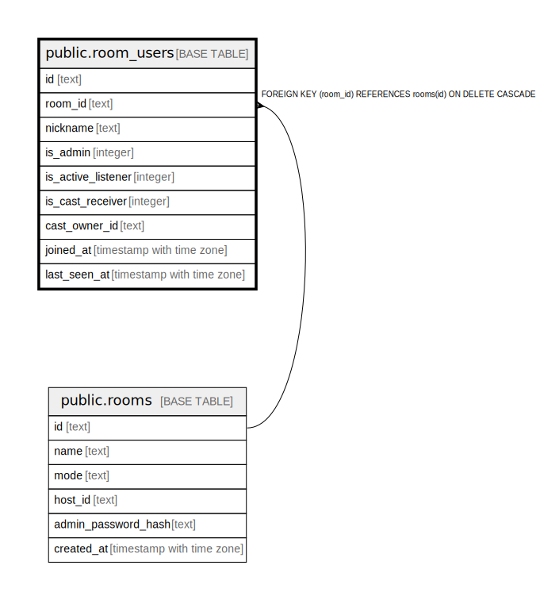

# public.room_users

## Columns

| Name | Type | Default | Nullable | Children | Parents | Comment |
| ---- | ---- | ------- | -------- | -------- | ------- | ------- |
| id | text |  | false |  |  |  |
| room_id | text |  | false |  | [public.rooms](public.rooms.md) |  |
| nickname | text |  | true |  |  |  |
| is_admin | integer | 0 | true |  |  |  |
| is_active_listener | integer | 0 | true |  |  |  |
| is_cast_receiver | integer | 0 | true |  |  |  |
| cast_owner_id | text |  | true |  |  |  |
| joined_at | timestamp with time zone | now() | true |  |  |  |
| last_seen_at | timestamp with time zone | now() | true |  |  |  |

## Constraints

| Name | Type | Definition |
| ---- | ---- | ---------- |
| room_users_id_not_null | n | NOT NULL id |
| room_users_room_id_not_null | n | NOT NULL room_id |
| room_users_room_id_fkey | FOREIGN KEY | FOREIGN KEY (room_id) REFERENCES rooms(id) ON DELETE CASCADE |
| room_users_pkey | PRIMARY KEY | PRIMARY KEY (id, room_id) |

## Indexes

| Name | Definition |
| ---- | ---------- |
| room_users_pkey | CREATE UNIQUE INDEX room_users_pkey ON public.room_users USING btree (id, room_id) |
| idx_room_users_room_id | CREATE INDEX idx_room_users_room_id ON public.room_users USING btree (room_id) |
| idx_room_users_last_seen | CREATE INDEX idx_room_users_last_seen ON public.room_users USING btree (last_seen_at) |

## Relations

---

> Generated by [tbls](https://github.com/k1LoW/tbls)
