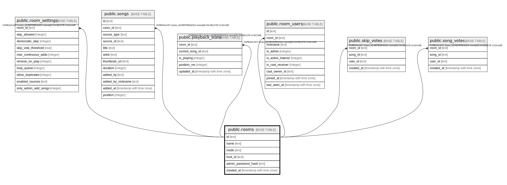

# public.rooms

## Columns

| Name | Type | Default | Nullable | Children | Parents | Comment |
| ---- | ---- | ------- | -------- | -------- | ------- | ------- |
| id | text | (gen_random_uuid())::text | false | [public.room_settings](public.room_settings.md) [public.songs](public.songs.md) [public.playback_state](public.playback_state.md) [public.room_users](public.room_users.md) [public.skip_votes](public.skip_votes.md) [public.song_votes](public.song_votes.md) |  |  |
| name | text |  | false |  |  |  |
| mode | text | 'server'::text | false |  |  |  |
| host_id | text |  | true |  |  |  |
| admin_password_hash | text |  | true |  |  |  |
| created_at | timestamp with time zone | now() | true |  |  |  |

## Constraints

| Name | Type | Definition |
| ---- | ---- | ---------- |
| rooms_id_not_null | n | NOT NULL id |
| rooms_mode_not_null | n | NOT NULL mode |
| rooms_name_not_null | n | NOT NULL name |
| rooms_pkey | PRIMARY KEY | PRIMARY KEY (id) |

## Indexes

| Name | Definition |
| ---- | ---------- |
| rooms_pkey | CREATE UNIQUE INDEX rooms_pkey ON public.rooms USING btree (id) |

## Relations

---

> Generated by [tbls](https://github.com/k1LoW/tbls)
