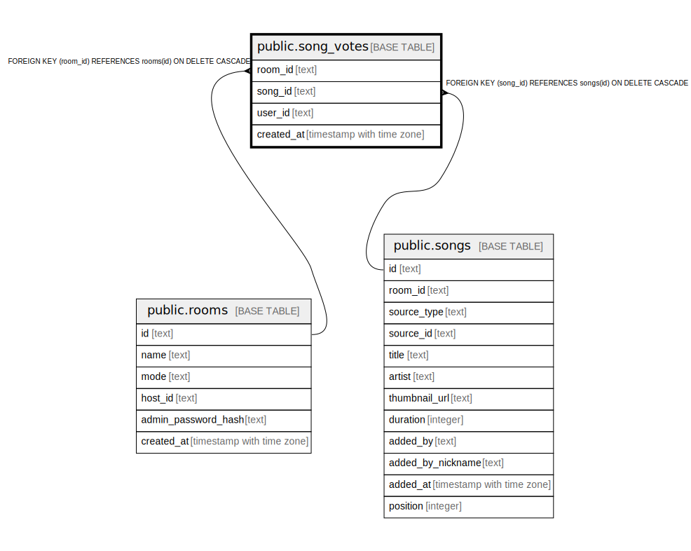

# public.song_votes

## Columns

| Name | Type | Default | Nullable | Children | Parents | Comment |
| ---- | ---- | ------- | -------- | -------- | ------- | ------- |
| room_id | text |  | false |  | [public.rooms](public.rooms.md) |  |
| song_id | text |  | false |  | [public.songs](public.songs.md) |  |
| user_id | text |  | false |  |  |  |
| created_at | timestamp with time zone | now() | true |  |  |  |

## Constraints

| Name | Type | Definition |
| ---- | ---- | ---------- |
| song_votes_room_id_not_null | n | NOT NULL room_id |
| song_votes_song_id_not_null | n | NOT NULL song_id |
| song_votes_user_id_not_null | n | NOT NULL user_id |
| song_votes_room_id_fkey | FOREIGN KEY | FOREIGN KEY (room_id) REFERENCES rooms(id) ON DELETE CASCADE |
| song_votes_song_id_fkey | FOREIGN KEY | FOREIGN KEY (song_id) REFERENCES songs(id) ON DELETE CASCADE |
| song_votes_pkey | PRIMARY KEY | PRIMARY KEY (room_id, song_id, user_id) |

## Indexes

| Name | Definition |
| ---- | ---------- |
| song_votes_pkey | CREATE UNIQUE INDEX song_votes_pkey ON public.song_votes USING btree (room_id, song_id, user_id) |
| idx_song_votes_song | CREATE INDEX idx_song_votes_song ON public.song_votes USING btree (room_id, song_id) |

## Relations

---

> Generated by [tbls](https://github.com/k1LoW/tbls)
