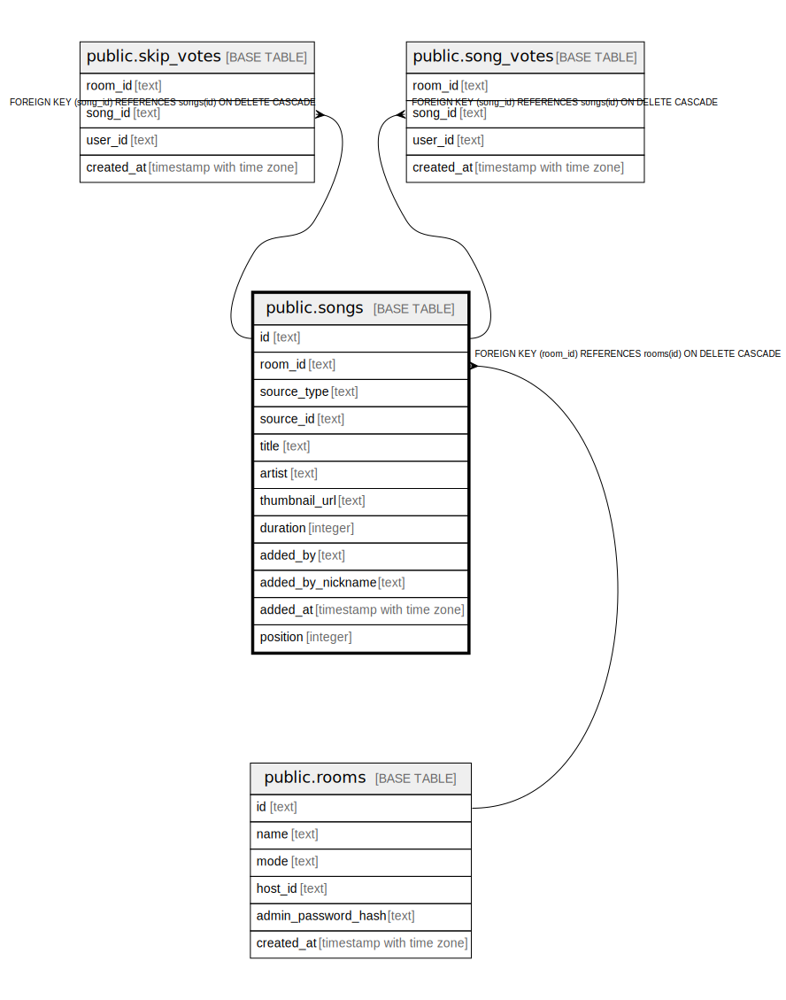

# public.songs

## Columns

| Name | Type | Default | Nullable | Children | Parents | Comment |
| ---- | ---- | ------- | -------- | -------- | ------- | ------- |
| id | text | (gen_random_uuid())::text | false | [public.skip_votes](public.skip_votes.md) [public.song_votes](public.song_votes.md) |  |  |
| room_id | text |  | false |  | [public.rooms](public.rooms.md) |  |
| source_type | text |  | false |  |  |  |
| source_id | text |  | false |  |  |  |
| title | text |  | false |  |  |  |
| artist | text |  | true |  |  |  |
| thumbnail_url | text |  | false |  |  |  |
| duration | integer |  | false |  |  |  |
| added_by | text |  | false |  |  |  |
| added_by_nickname | text |  | true |  |  |  |
| added_at | timestamp with time zone | now() | true |  |  |  |
| position | integer |  | true |  |  |  |

## Constraints

| Name | Type | Definition |
| ---- | ---- | ---------- |
| songs_added_by_not_null | n | NOT NULL added_by |
| songs_duration_not_null | n | NOT NULL duration |
| songs_id_not_null | n | NOT NULL id |
| songs_room_id_not_null | n | NOT NULL room_id |
| songs_source_id_not_null | n | NOT NULL source_id |
| songs_source_type_not_null | n | NOT NULL source_type |
| songs_thumbnail_url_not_null | n | NOT NULL thumbnail_url |
| songs_title_not_null | n | NOT NULL title |
| songs_room_id_fkey | FOREIGN KEY | FOREIGN KEY (room_id) REFERENCES rooms(id) ON DELETE CASCADE |
| songs_pkey | PRIMARY KEY | PRIMARY KEY (id) |

## Indexes

| Name | Definition |
| ---- | ---------- |
| songs_pkey | CREATE UNIQUE INDEX songs_pkey ON public.songs USING btree (id) |
| idx_songs_room_id | CREATE INDEX idx_songs_room_id ON public.songs USING btree (room_id) |
| idx_songs_room_position | CREATE INDEX idx_songs_room_position ON public.songs USING btree (room_id, "position") |

## Relations

---

> Generated by [tbls](https://github.com/k1LoW/tbls)
