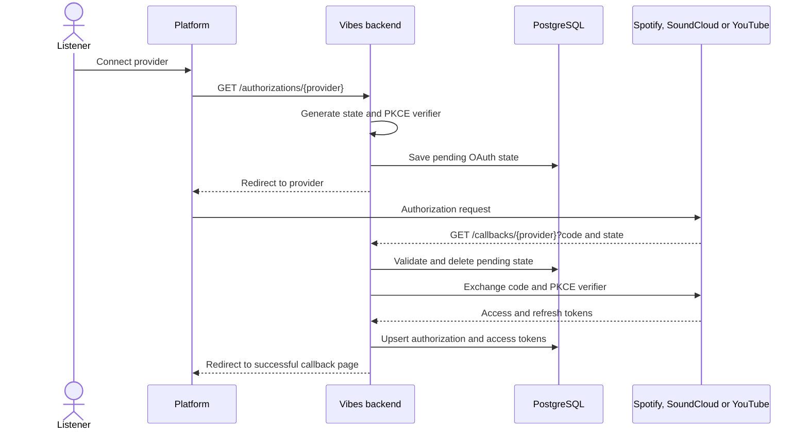
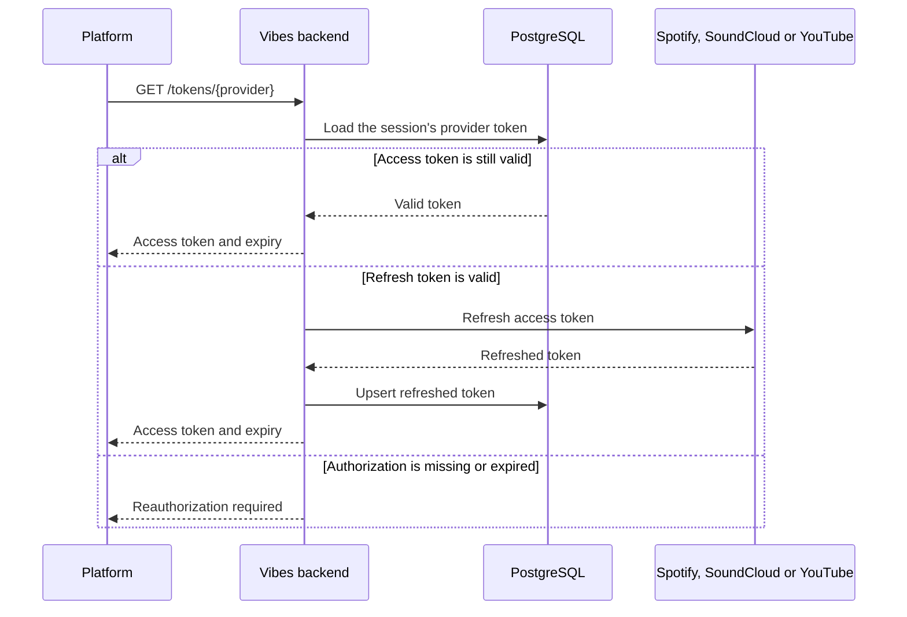

# Provider Authorization and Tokens

## Authenticate with Spotify, SoundCloud, or YouTube

The provider-specific clients share the same OAuth sequence. Pending state and
PKCE data are stored before redirecting, then consumed atomically by the
callback.

## Retrieve or refresh a provider token

