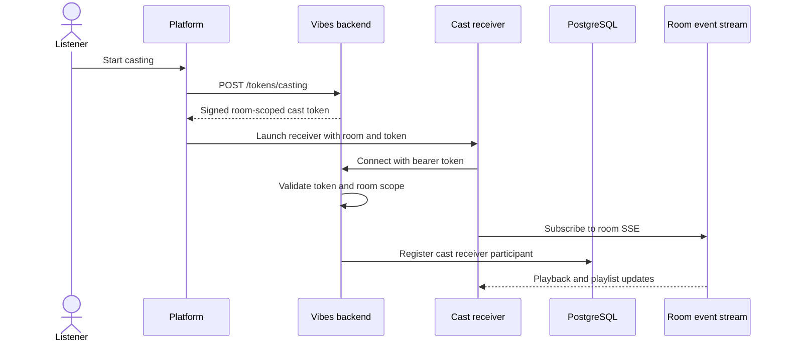

# Cast Receiver Connection

The casting token is signed and scoped to one room. The receiver uses it as a
bearer token and then consumes the same room events as other playback clients.

```mermaid
sequenceDiagram
    actor Listener
    participant Platform
    participant API as Vibes backend
    participant Cast as Cast receiver
    participant DB as PostgreSQL
    participant Events as Room event stream

    Listener->>Platform: Start casting
    Platform->>API: POST /tokens/casting
    API-->>Platform: Signed room-scoped cast token
    Platform->>Cast: Launch receiver with room and token
    Cast->>API: Connect with bearer token
    API->>API: Validate token and room scope
    Cast->>Events: Subscribe to room SSE
    API->>DB: Register cast receiver participant
    Events-->>Cast: Playback and playlist updates
```
