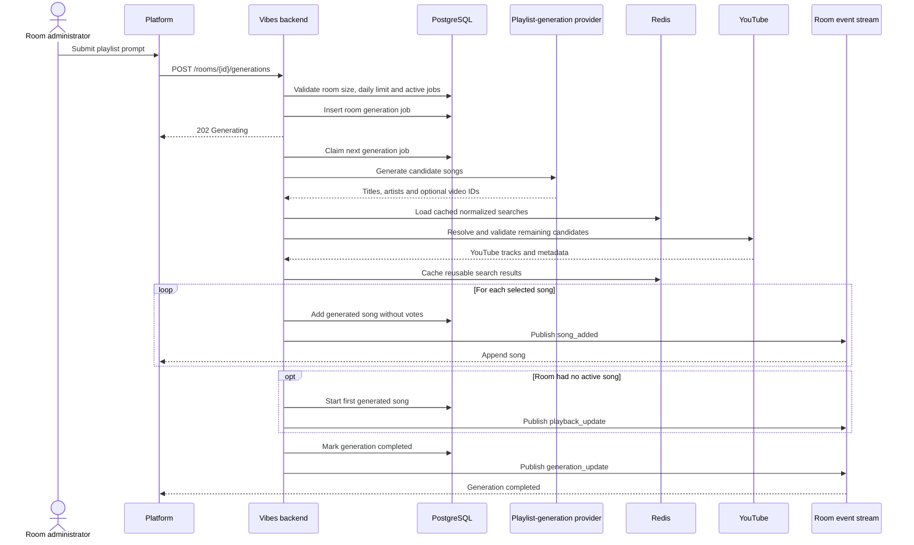
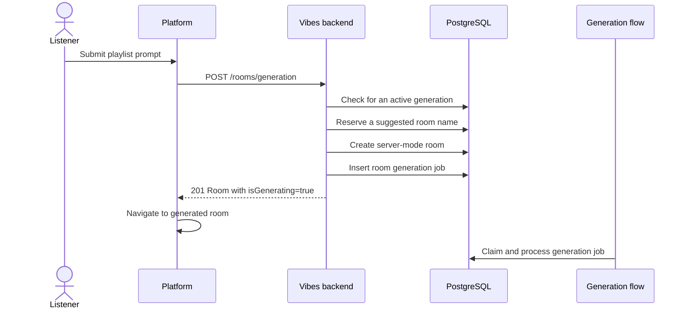

# AI Playlist Generation

## Generate songs for an existing room

Generation is asynchronous. A request creates a durable PostgreSQL job, and the
room remains recoverable if the browser refreshes or disconnects.

## Generate a new room and playlist

The landing-page generation endpoint reserves an available room name, creates a
server-mode room with default settings, and queues the same asynchronous
generation flow.

