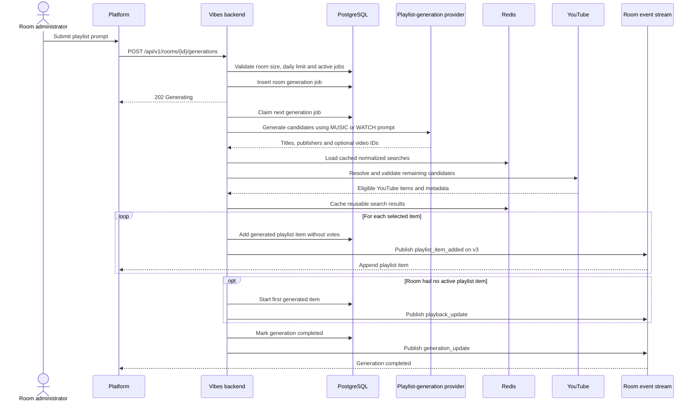
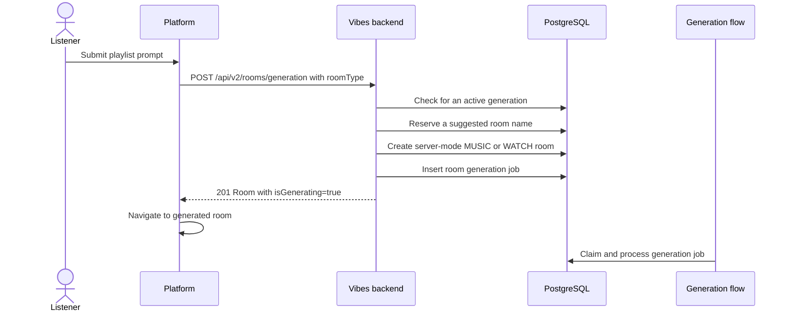

# AI Playlist Generation

## Generate playlist items for an existing room

Generation is asynchronous. A request creates a durable PostgreSQL job, and the
room remains recoverable if the browser refreshes or disconnects. The worker
selects the MUSIC or WATCH prompt from the stored room type. Music prompts retain
their music-oriented wording; Watch prompts recommend videos to watch based on
the request. Provider filtering follows the same room-type policy as search.

```mermaid
sequenceDiagram
    actor Admin as Room administrator
    participant Platform
    participant API as Vibes backend
    participant DB as PostgreSQL
    participant AI as Playlist-generation provider
    participant Cache as Redis
    participant YouTube
    participant Events as Room event stream

    Admin->>Platform: Submit playlist prompt
    Platform->>API: POST /api/v1/rooms/{id}/generations
    API->>DB: Validate room size, daily limit and active jobs
    API->>DB: Insert room generation job
    API-->>Platform: 202 Generating

    API->>DB: Claim next generation job
    API->>AI: Generate candidates using MUSIC or WATCH prompt
    AI-->>API: Titles, publishers and optional video IDs
    API->>Cache: Load cached normalized searches
    API->>YouTube: Resolve and validate remaining candidates
    YouTube-->>API: Eligible YouTube items and metadata
    API->>Cache: Cache reusable search results

    loop For each selected item
        API->>DB: Add generated playlist item without votes
        API->>Events: Publish playlist_item_added on v3
        Events-->>Platform: Append playlist item
    end

    opt Room had no active playlist item
        API->>DB: Start first generated item
        API->>Events: Publish playback_update
    end

    API->>DB: Mark generation completed
    API->>Events: Publish generation_update
    Events-->>Platform: Generation completed
```

## Generate a new room and playlist

The landing-page generation endpoint reserves an available room name, creates a
server-mode room with default settings, and queues the same asynchronous
generation flow.

```mermaid
sequenceDiagram
    actor Listener
    participant Platform
    participant API as Vibes backend
    participant DB as PostgreSQL
    participant Worker as Generation flow

    Listener->>Platform: Submit playlist prompt
    Platform->>API: POST /api/v2/rooms/generation with roomType
    API->>DB: Check for an active generation
    API->>DB: Reserve a suggested room name
    API->>DB: Create server-mode MUSIC or WATCH room
    API->>DB: Insert room generation job
    API-->>Platform: 201 Room with isGenerating=true
    Platform->>Platform: Navigate to generated room
    Worker->>DB: Claim and process generation job
```
