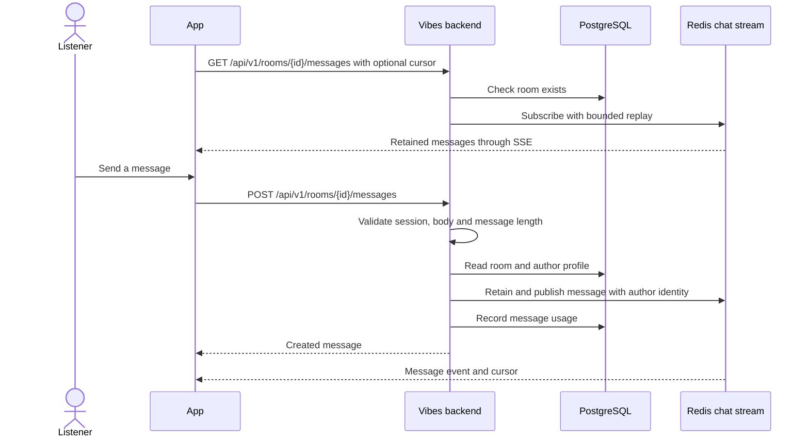

# Chat and Room Activity

## Send and receive messages

Chat uses the listener's signed session and room-scoped administrator status.
The backend validates trimmed message text independently of frontend limits.

The stream is a bounded Redis replay window, not a permanent PostgreSQL chat
archive. A new subscriber receives retained history; a reconnect can resume
after its last event. Message usage counters are stored separately for
administration. Clients bound their in-memory history as well.

## Show room activity

Song additions, deletions, votes, skips, skip votes, display-name changes, room
settings changes, and initial password setup
publish activity entries from their existing backend flows. They use the same
chat presentation without requiring clients to infer actions from queue diffs.

Settings activity compares the previous values with the saved room and emits
one entry per changed setting. Unchanged values, reordered provider lists,
failed updates, and rejected permissions do not produce activity. The author's
name comes from the session profile, not the request. Setting entries use the
`settings` kind, not `chat`, so clients render them as room activity alongside
skips and votes. The text includes the action and its resulting value. They use
the `settings_activity` SSE event in the same retained chat stream. Older clients
ignore this additive event instead of rejecting an unknown message kind or
showing it as user-written chat. Updated clients handle both SSE event names and
recognize the legacy `activity` flag when replaying older setting entries.

First-time password setup emits an `added` entry saying "a password to the room".
Signing in with an existing password produces no entry. Neither the password
nor its hash is included. Activity does not increment user-sent message usage.
Both single and batch notifications route message events to the retained chat
stream, separate from playback updates.

Disabling chat is a device preference. It removes that device's chat interface
without disabling the shared room or its playback stream.
