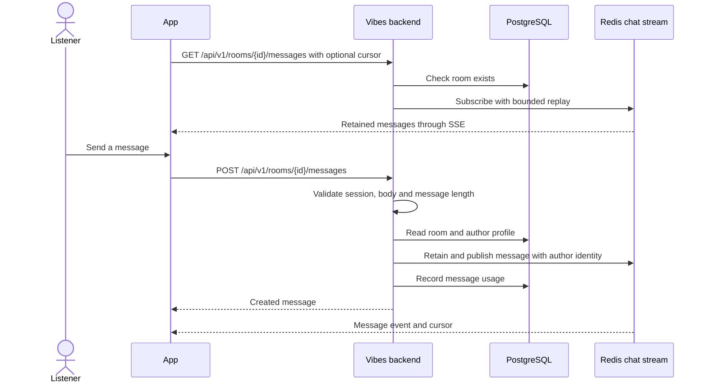

# Chat and Room Activity

## Send and receive messages

Chat uses the listener's signed session and room-scoped administrator status.
The backend validates trimmed message text independently of frontend limits.

The stream is a bounded Redis replay window, not a permanent PostgreSQL chat
archive. A new subscriber receives retained history; a reconnect can resume
after its last event. Message usage counters are stored separately for
administration. Clients bound their in-memory history as well.

## Show room activity

Song additions, deletions, votes, skips, skip votes, and display-name changes
publish activity entries from their existing backend flows. They use the same
chat presentation without requiring clients to infer actions from queue diffs.

Disabling chat is a device preference. It removes that device's chat interface
without disabling the shared room or its playback stream.
