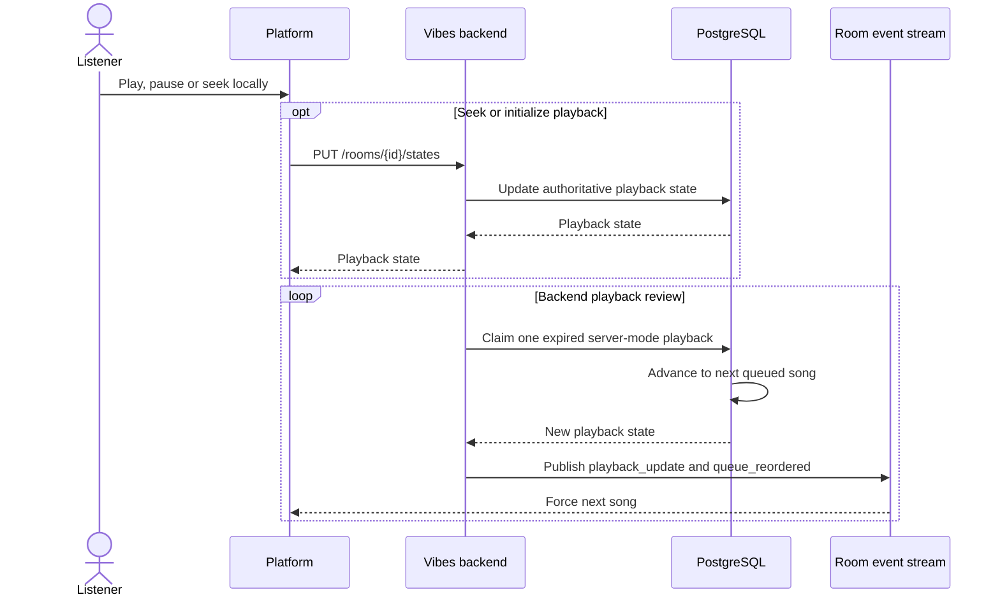
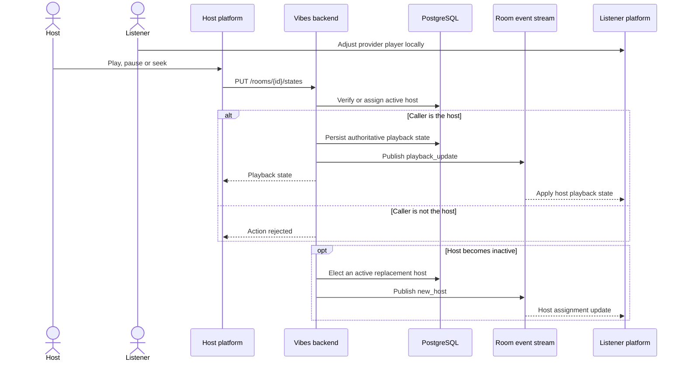

# Playback Modes

## Server mode

The backend owns playlist progression in server mode. Browser play and pause
controls may alter local playback, while seek and initial play update the
authoritative state.

## Host mode

The active host is authoritative for shared play, pause, and seek actions.
Listeners may still use provider controls locally until the host sends another
authoritative update.

