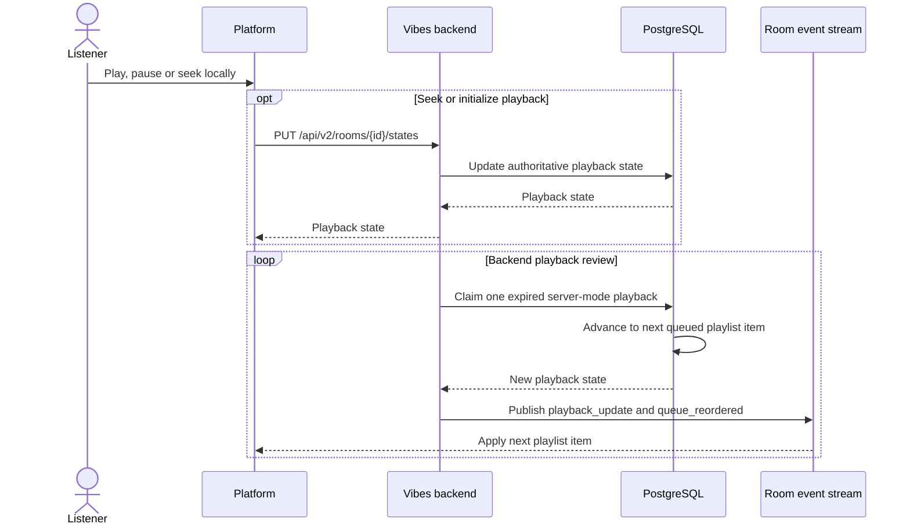
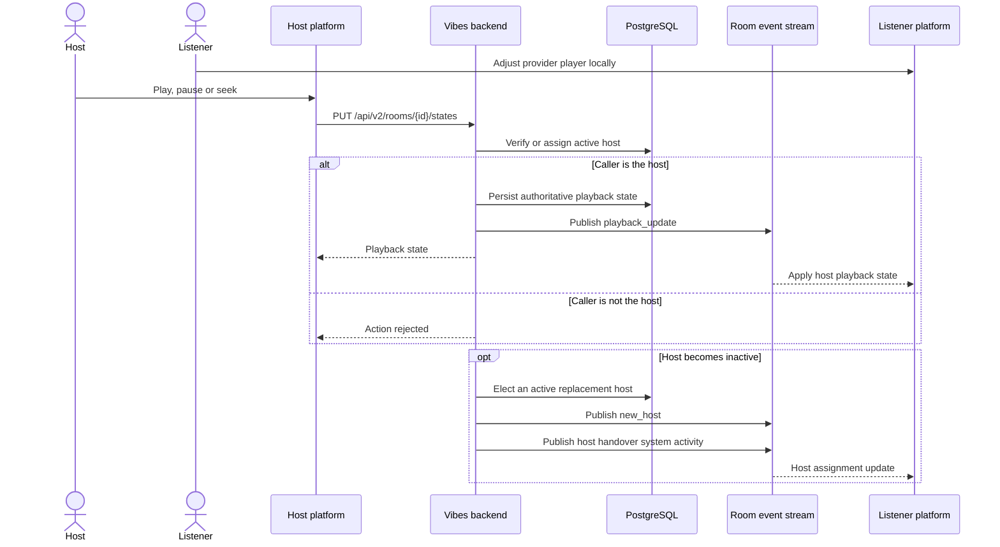

# Playback Modes

MUSIC and WATCH share these playback modes. Room type controls provider and
content policy; it does not replace the separate server/host authority setting.
The current clients use v2 playback contracts and the v3 room event stream.

## Server mode

The backend owns playlist progression in server mode. Browser play and pause
controls may alter local playback, while seek and initial play update the
authoritative state.

```mermaid
sequenceDiagram
    actor Listener
    participant Platform
    participant API as Vibes backend
    participant DB as PostgreSQL
    participant Events as Room event stream

    Listener->>Platform: Play, pause or seek locally
    opt Seek or initialize playback
        Platform->>API: PUT /api/v2/rooms/{id}/states
        API->>DB: Update authoritative playback state
        DB-->>API: Playback state
        API-->>Platform: Playback state
    end

    loop Backend playback review
        API->>DB: Claim one expired server-mode playback
        DB->>DB: Advance to next queued playlist item
        DB-->>API: New playback state
        API->>Events: Publish playback_update and queue_reordered
        Events-->>Platform: Apply next playlist item
    end
```

## Host mode

The active host is authoritative for shared play, pause, and seek actions.
Listeners may still use provider controls locally until the host sends another
authoritative update.

```mermaid
sequenceDiagram
    actor Host
    actor Listener
    participant HostUI as Host platform
    participant API as Vibes backend
    participant DB as PostgreSQL
    participant Events as Room event stream
    participant ListenerUI as Listener platform

    Listener->>ListenerUI: Adjust provider player locally
    Host->>HostUI: Play, pause or seek
    HostUI->>API: PUT /api/v2/rooms/{id}/states
    API->>DB: Verify or assign active host

    alt Caller is the host
        API->>DB: Persist authoritative playback state
        API->>Events: Publish playback_update
        API-->>HostUI: Playback state
        Events-->>ListenerUI: Apply host playback state
    else Caller is not the host
        API-->>HostUI: Action rejected
    end

    opt Host becomes inactive
        API->>DB: Elect an active replacement host
        API->>Events: Publish new_host
        API->>Events: Publish host handover system activity
        Events-->>ListenerUI: Host assignment update
    end
```

Host badges are independent of administrator badges. New chat entries carry
the sender's host status. Host handovers notify connected participants and the
new host; the host's authoritative player does not offer a reset-to-host action.
