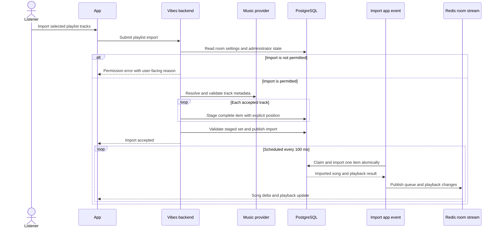

# Playlist Staging and Incremental Import

## Import a provider playlist

The HTTP handler validates permissions and resolves provider metadata before
publishing work. Items are staged one by one; an incomplete staging attempt is
not visible as a runnable import.

The staging request has a two-minute overall budget, while individual database
calls remain bounded. Failed staging is cleaned up and abandoned work is covered
by maintenance. Item identity and position travel together, rather than being
zipped from parallel SQL arrays. The worker starts playback when an import adds
the first song to an empty room.
