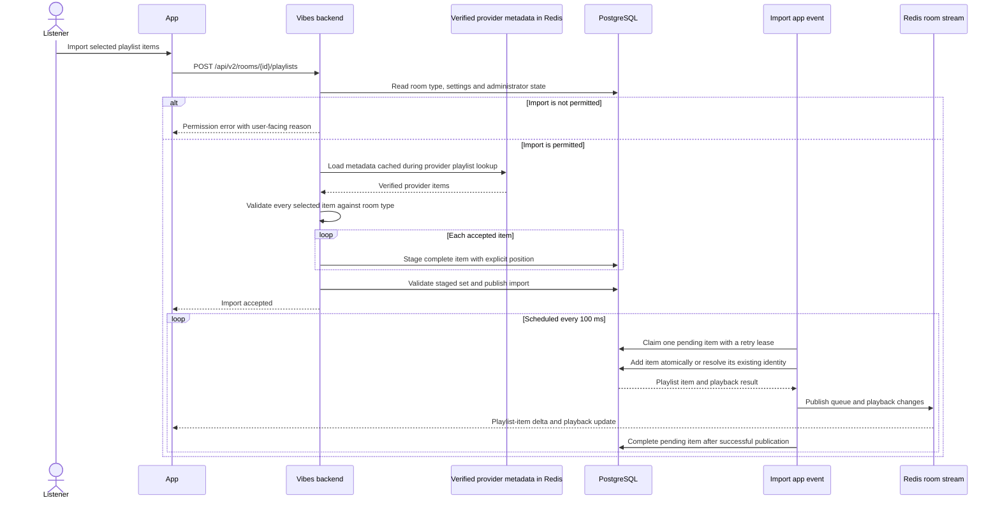

# Playlist Staging and Incremental Import

## Import a provider playlist

The HTTP handler validates permissions and resolves provider metadata before
publishing work. Items are staged one by one; an incomplete staging attempt is
not visible as a runnable import. WATCH permits only YouTube and accepts eligible
videos across categories. MUSIC accepts music-category YouTube items and enabled
SoundCloud items. Both reject live, made-for-kids and non-embeddable YouTube videos.

```mermaid
sequenceDiagram
    actor Listener
    participant App
    participant API as Vibes backend
    participant Cache as Verified provider metadata in Redis
    participant DB as PostgreSQL
    participant Worker as Import app event
    participant Events as Redis room stream

    Listener->>App: Import selected playlist items
    App->>API: POST /api/v2/rooms/{id}/playlists
    API->>DB: Read room type, settings and administrator state
    alt Import is not permitted
        API-->>App: Permission error with user-facing reason
    else Import is permitted
        API->>Cache: Load metadata cached during provider playlist lookup
        Cache-->>API: Verified provider items
        API->>API: Validate every selected item against room type
        loop Each accepted item
            API->>DB: Stage complete item with explicit position
        end
        API->>DB: Validate staged set and publish import
        API-->>App: Import accepted
        loop Scheduled every 100 ms
            Worker->>DB: Claim one pending item with a retry lease
            Worker->>DB: Add item atomically or resolve its existing identity
            DB-->>Worker: Playlist item and playback result
            Worker->>Events: Publish queue and playback changes
            Events-->>App: Playlist-item delta and playback update
            Worker->>DB: Complete pending item after successful publication
        end
    end
```

The staging request has a two-minute overall budget, while individual database
calls remain bounded. Failed staging is cleaned up and abandoned work is covered
by maintenance. Item identity and position travel together, rather than being
zipped from parallel SQL arrays. The worker starts playback when an import adds
the first item to an empty room.

Failed event publication leaves the pending item available for the bounded retry
policy. Retries publish a current queue snapshot instead of repeating an add
delta, and resolve an existing item ID even when the room allows duplicates.
Publication precedes completion, so a completion failure may cause a safe state
refresh on the next attempt rather than silently losing the notification.
