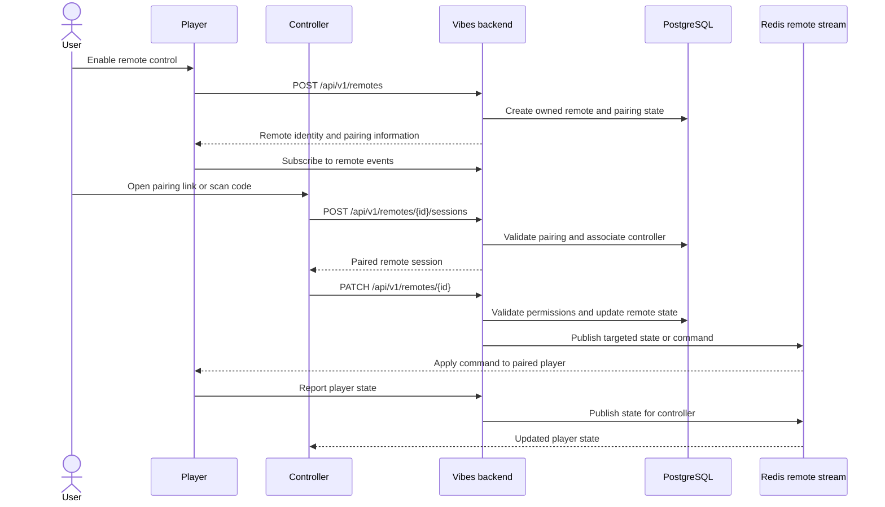

# Remote Pairing and Targeted Control

## Pair a controller with a player

The player owns the remote session. Pairing gives another device control of that
player without making the controller an additional music listener.

Targeted player state and room-wide playback events remain separate. Clients
track the origin of changes to avoid command echoes. Ending the remote session
removes that pairing; it does not delete the room or its queue.
