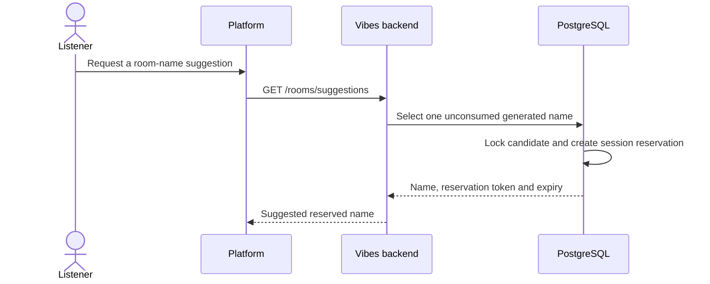
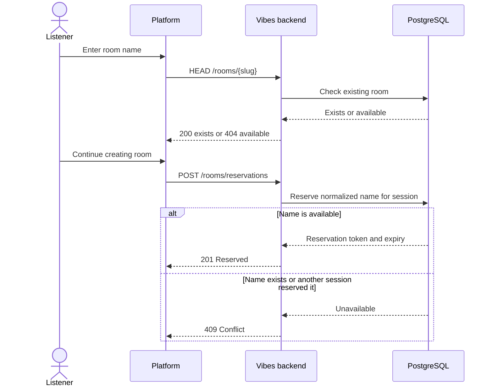
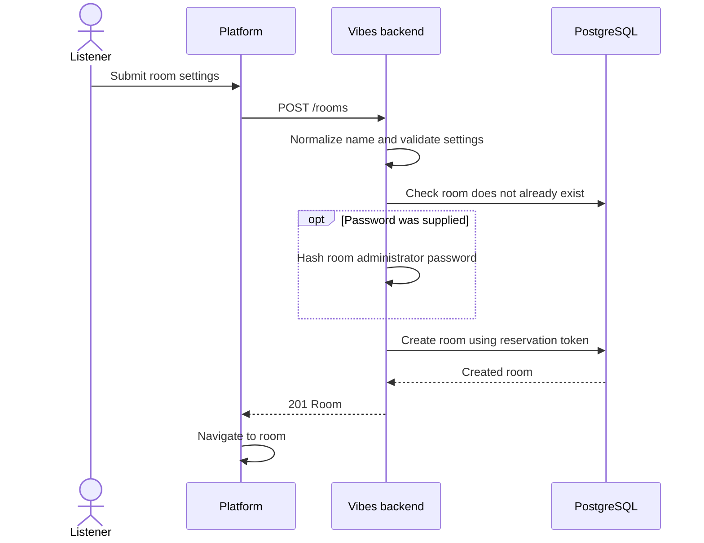
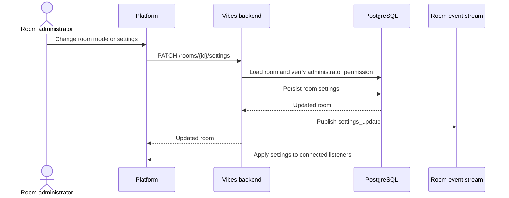

# Room Names, Creation, and Settings

## Generate and reserve a room name

Room name suggestions come from the generated name pool and are reserved for the
current signed session before the frontend presents them.

## Check and reserve room name availability

A lightweight HEAD request checks whether a room already exists. The reservation
endpoint provides the authoritative availability check used before creation.

## Create a room

## Update room settings

