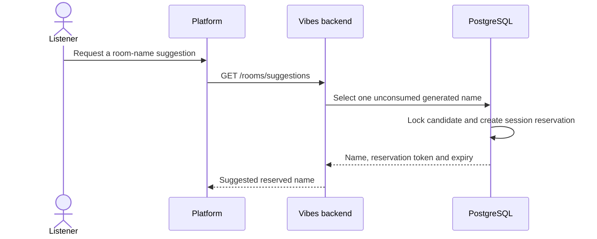
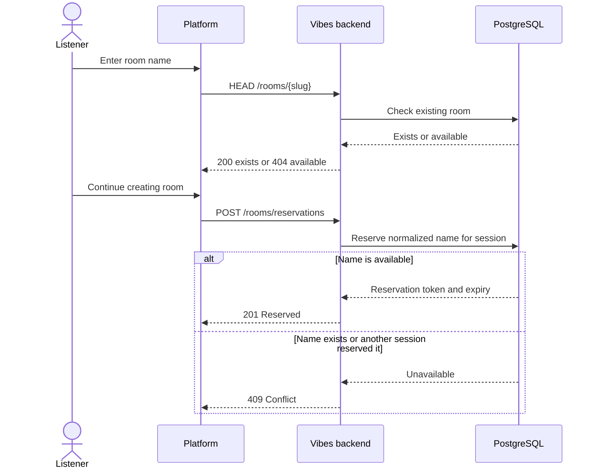
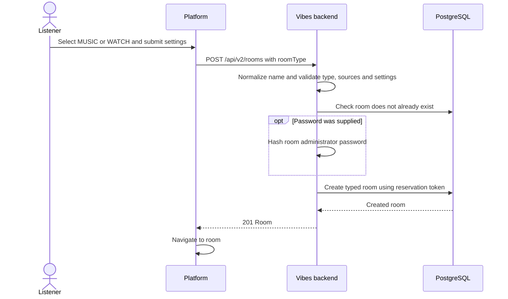
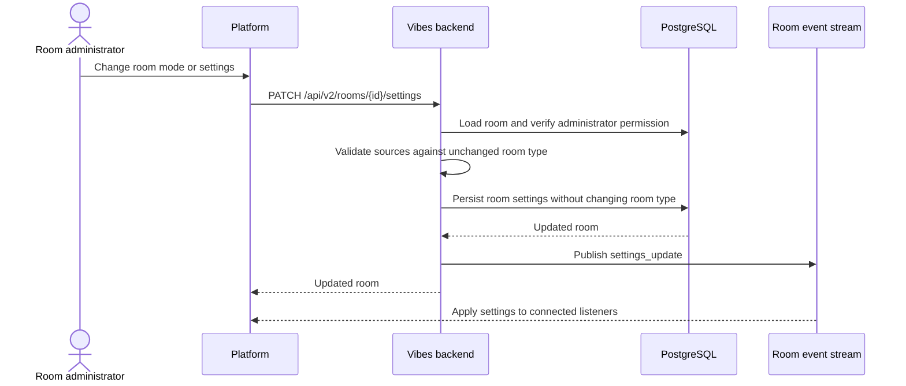

# Room Names, Creation, and Settings

## Generate and reserve a room name

Room name suggestions come from the generated name pool and are reserved for the
current signed session before the frontend presents them.

```mermaid
sequenceDiagram
    actor Listener
    participant Platform
    participant API as Vibes backend
    participant DB as PostgreSQL

    Listener->>Platform: Request a room-name suggestion
    Platform->>API: GET /rooms/suggestions
    API->>DB: Select one unconsumed generated name
    DB->>DB: Lock candidate and create session reservation
    DB-->>API: Name, reservation token and expiry
    API-->>Platform: Suggested reserved name
```

## Check and reserve room name availability

A lightweight HEAD request checks whether a room already exists. The reservation
endpoint provides the authoritative availability check used before creation.

```mermaid
sequenceDiagram
    actor Listener
    participant Platform
    participant API as Vibes backend
    participant DB as PostgreSQL

    Listener->>Platform: Enter room name
    Platform->>API: HEAD /rooms/{slug}
    API->>DB: Check existing room
    DB-->>API: Exists or available
    API-->>Platform: 200 exists or 404 available

    Listener->>Platform: Continue creating room
    Platform->>API: POST /rooms/reservations
    API->>DB: Reserve normalized name for session

    alt Name is available
        DB-->>API: Reservation token and expiry
        API-->>Platform: 201 Reserved
    else Name exists or another session reserved it
        DB-->>API: Unavailable
        API-->>Platform: 409 Conflict
    end
```

## Create a room

The selected experience becomes the immutable `roomType`. It defaults to MUSIC
when omitted; WATCH only permits YouTube. Playback `mode` remains a separate
choice. Legacy v1 creation continues to create MUSIC rooms.

```mermaid
sequenceDiagram
    actor Listener
    participant Platform
    participant API as Vibes backend
    participant DB as PostgreSQL

    Listener->>Platform: Select MUSIC or WATCH and submit settings
    Platform->>API: POST /api/v2/rooms with roomType
    API->>API: Normalize name and validate type, sources and settings
    API->>DB: Check room does not already exist
    opt Password was supplied
        API->>API: Hash room administrator password
    end
    API->>DB: Create typed room using reservation token
    DB-->>API: Created room
    API-->>Platform: 201 Room
    Platform->>Platform: Navigate to room
```

## Update room settings

```mermaid
sequenceDiagram
    actor Admin as Room administrator
    participant Platform
    participant API as Vibes backend
    participant DB as PostgreSQL
    participant Events as Room event stream

    Admin->>Platform: Change room mode or settings
    Platform->>API: PATCH /api/v2/rooms/{id}/settings
    API->>DB: Load room and verify administrator permission
    API->>API: Validate sources against unchanged room type
    API->>DB: Persist room settings without changing room type
    DB-->>API: Updated room
    API->>Events: Publish settings_update
    API-->>Platform: Updated room
    Events-->>Platform: Apply settings to connected listeners
```

## Browse rooms and load community totals

```mermaid
sequenceDiagram
    actor Participant
    participant Platform
    participant API as Vibes backend
    participant DB as PostgreSQL
    participant Cache as Redis

    Participant->>Platform: Select MUSIC or WATCH
    Platform->>API: GET /api/v3/rooms/public?roomType=MUSIC or WATCH
    API->>DB: Filter public rooms by type and requested live state
    DB-->>API: Matching rooms and pagination totals
    API-->>Platform: Typed room results
    Platform->>API: GET /api/v2/stats?roomType=MUSIC or WATCH
    API->>Cache: Read type-specific statistics
    opt Cache miss
        API->>DB: Count rooms, playlist items and participants for type
        DB-->>API: Type-specific totals
        API->>Cache: Store type-specific statistics
    end
    API-->>Platform: Counts for selected experience only
```
