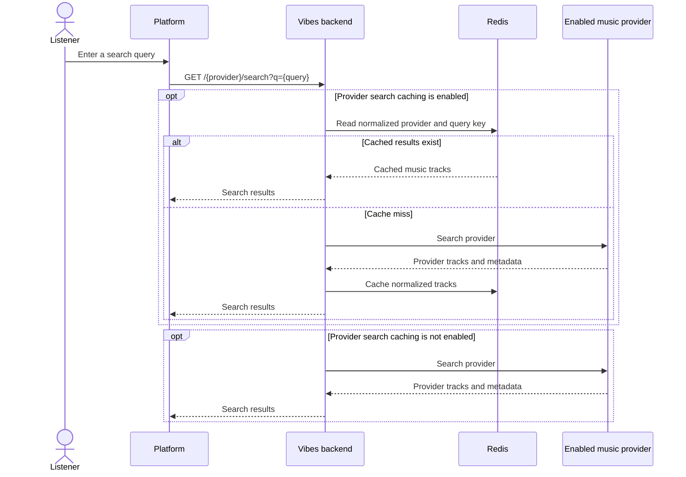

# Music Search and Provider Caching

YouTube and SoundCloud searches use the normalized Redis cache before spending
provider search quota. Spotify follows the same public API shape but currently
queries its provider client directly.

