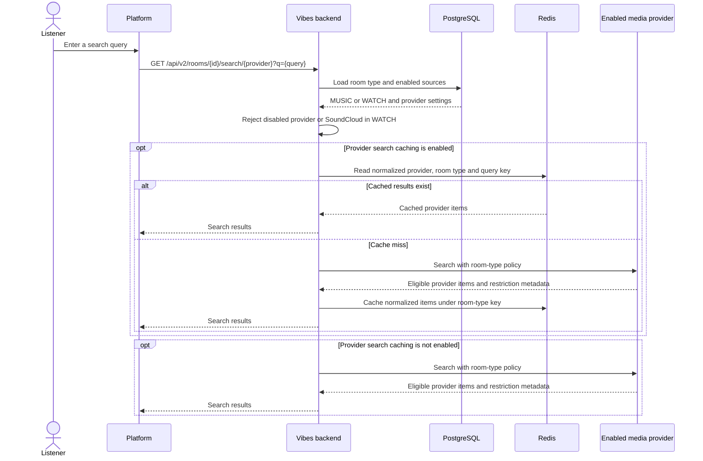

# Room Search and Provider Caching

YouTube and SoundCloud searches use the normalized Redis cache before spending
provider search quota. The room's immutable type selects the search policy:
MUSIC permits music-category YouTube results and SoundCloud, while WATCH permits
YouTube videos across categories. Both exclude live, made-for-kids, and
non-embeddable YouTube results. The legacy unscoped v1 search remains music-only.

```mermaid
sequenceDiagram
    actor Listener
    participant Platform
    participant API as Vibes backend
    participant DB as PostgreSQL
    participant Cache as Redis
    participant Provider as Enabled media provider

    Listener->>Platform: Enter a search query
    Platform->>API: GET /api/v2/rooms/{id}/search/{provider}?q={query}
    API->>DB: Load room type and enabled sources
    DB-->>API: MUSIC or WATCH and provider settings
    API->>API: Reject disabled provider or SoundCloud in WATCH

    opt Provider search caching is enabled
        API->>Cache: Read normalized provider, room type and query key
        alt Cached results exist
            Cache-->>API: Cached provider items
            API-->>Platform: Search results
        else Cache miss
            API->>Provider: Search with room-type policy
            Provider-->>API: Eligible provider items and restriction metadata
            API->>Cache: Cache normalized items under room-type key
            API-->>Platform: Search results
        end
    end

    opt Provider search caching is not enabled
        API->>Provider: Search with room-type policy
        Provider-->>API: Eligible provider items and restriction metadata
        API-->>Platform: Search results
    end
```
