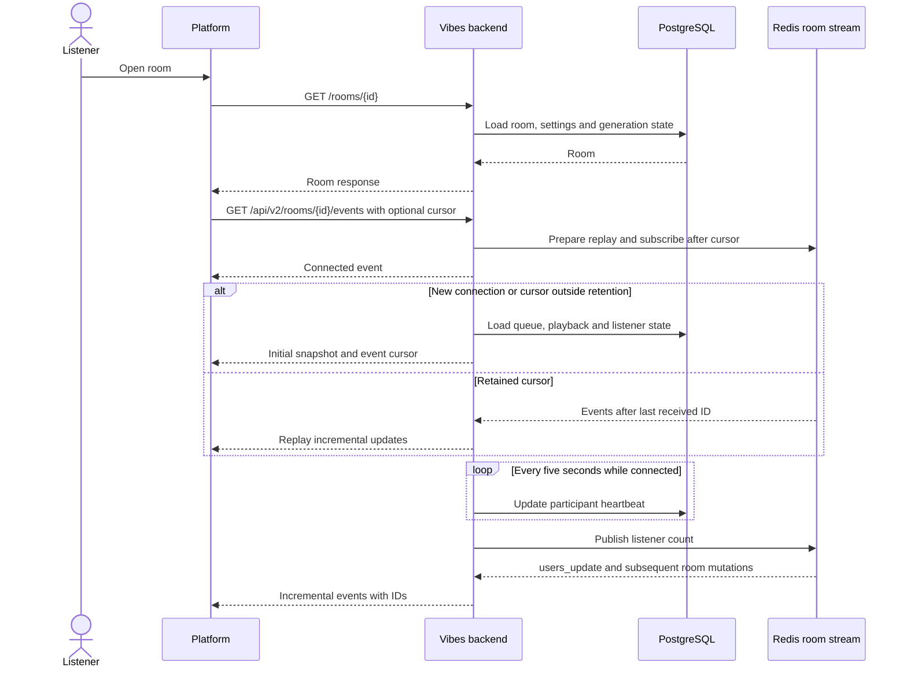
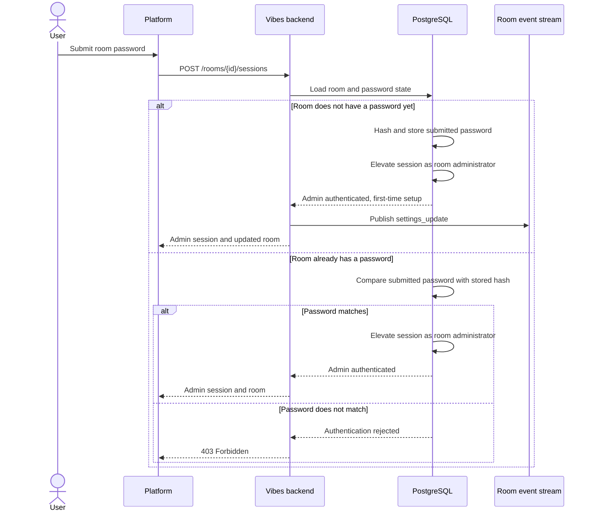

# Sessions and Live Room Updates

## Join a room

Opening the room event stream registers and maintains an active listener. The
signed session cookie identifies a browser without requiring account creation.

The v1 stream remains available for clients using full queue updates. The v2
stream starts with `songs_snapshot` when necessary, then delivers individual
queue changes. Clients persist the delivered cursor and reconnect using
`Last-Event-ID` or `lastEventId`. A heartbeat is not a queue snapshot.

Chat uses a separate messages stream, so clients can opt out of that UI without
dropping room playback updates. See [chat and room activity](messages.md).

## Set a room password or authenticate as room administrator

The room-session endpoint handles first-time password setup and subsequent
administrator authentication. Passwords are stored only as bcrypt hashes.

