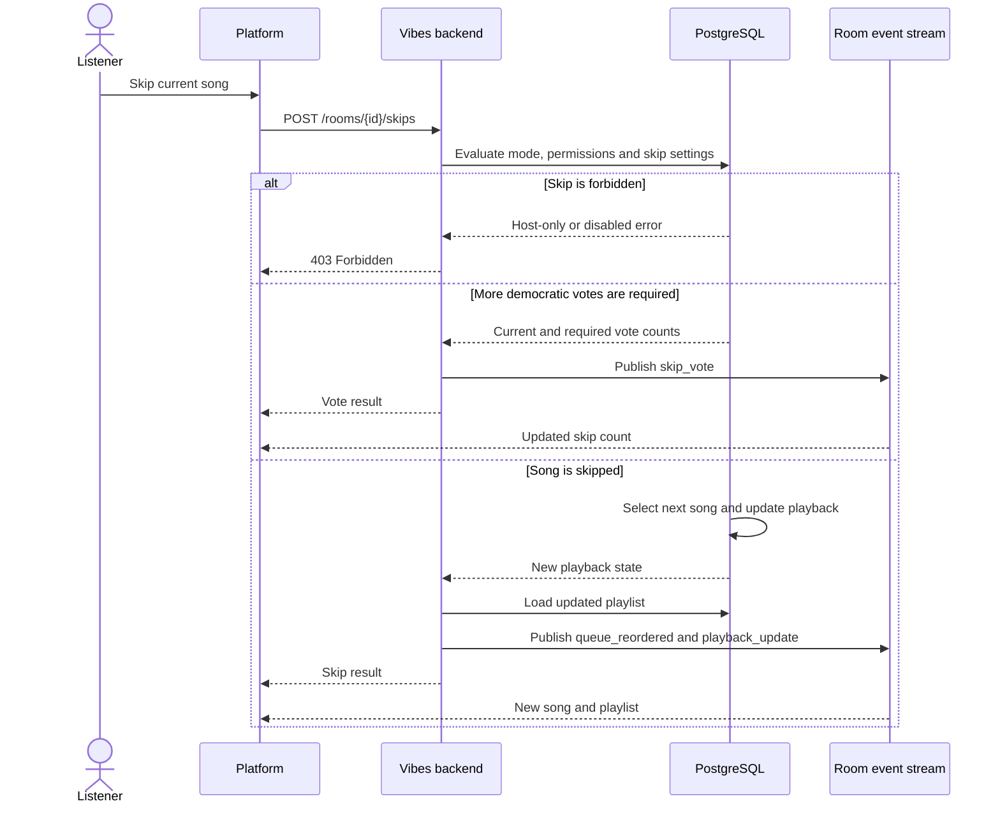

# Skip the Current Song

Host mode only permits the host to skip. Server mode may either skip immediately
or collect democratic skip votes according to room settings.

```mermaid
sequenceDiagram
    actor Listener
    participant Platform
    participant API as Vibes backend
    participant DB as PostgreSQL
    participant Events as Room event stream

    Listener->>Platform: Skip current song
    Platform->>API: POST /rooms/{id}/skips
    API->>DB: Evaluate mode, permissions and skip settings

    alt Skip is forbidden
        DB-->>API: Host-only or disabled error
        API-->>Platform: 403 Forbidden
    else More democratic votes are required
        DB-->>API: Current and required vote counts
        API->>Events: Publish skip_vote
        API-->>Platform: Vote result
        Events-->>Platform: Updated skip count
    else Song is skipped
        DB->>DB: Select next song and update playback
        DB-->>API: New playback state
        API->>DB: Load updated playlist
        API->>Events: Publish queue_reordered and playback_update
        API-->>Platform: Skip result
        Events-->>Platform: New song and playlist
    end
```
