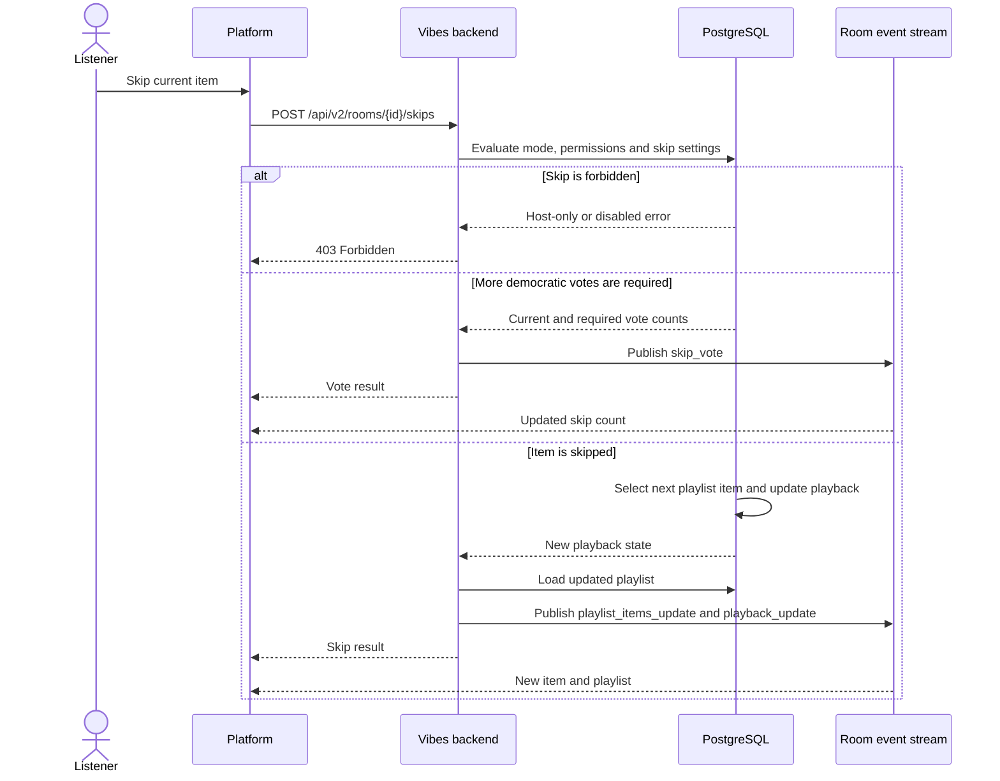

# Skip the Current Playlist Item

Host mode only permits the host to skip. Server mode may either skip immediately
or collect democratic skip votes according to room settings. This authority
model applies to both MUSIC and WATCH rooms.

