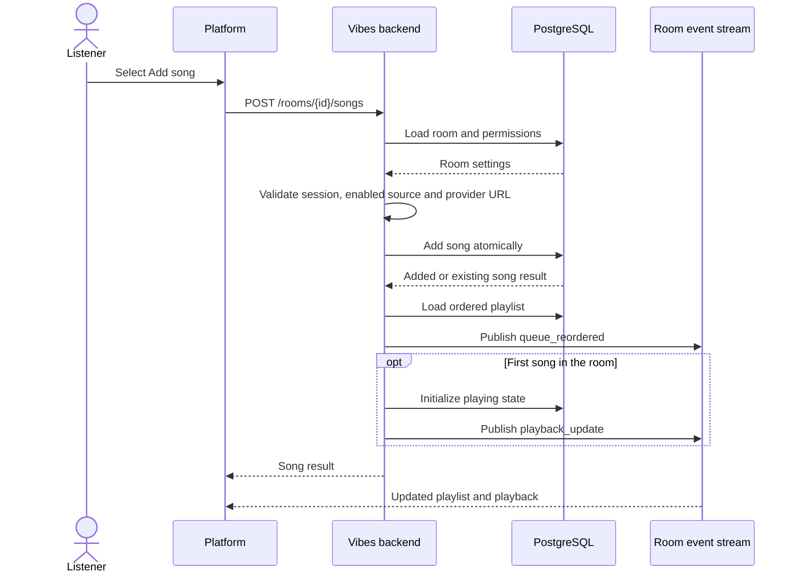
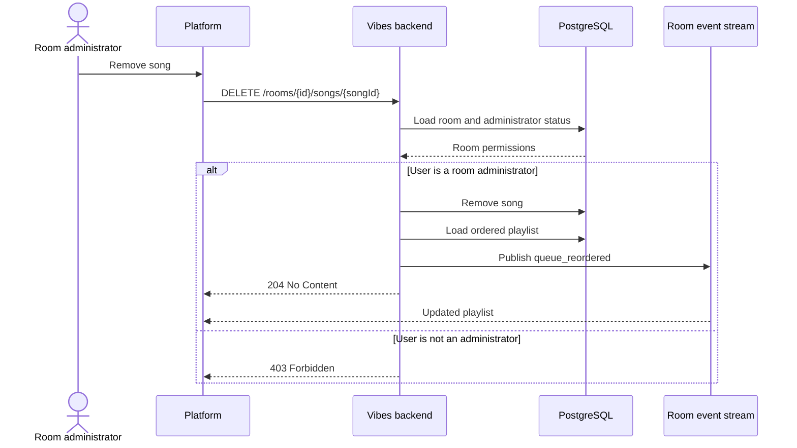
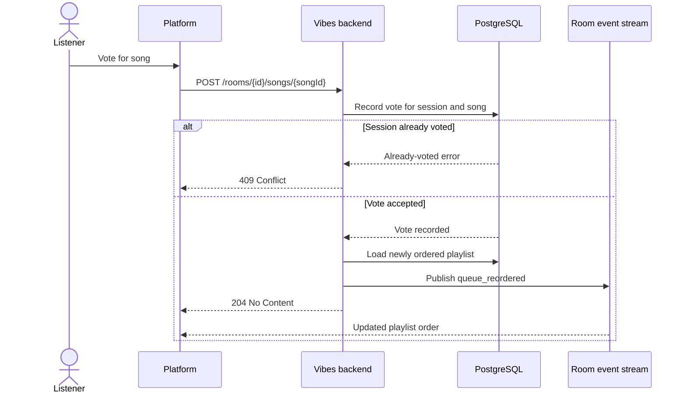

# Playlist Song Operations

## Add a song

The frontend submits normalized metadata returned by an enabled provider. The
backend validates the room and source before inserting the song.

Manual additions receive the adding listener's vote. Their queue position is
determined by the database's vote and timestamp ordering, not by appending the
song in the client. The existing ordered-playlist read supplies that position.
The v1 stream still receives `songs_update`; the v2 stream receives one
`song_updated` event containing the song and its zero-based `position`.
Clients must insert missing songs as well as move existing songs for this event.
This uses the same event contract as voting and duplicate-song additions, so
released v2 clients do not need a schema change. Background playlist imports
still append unvoted songs through `song_added`.

## Remove a song

Removing a song is restricted to a room administrator.

## Vote for a song

Each signed session can vote once for a given song. Votes affect playlist order
but do not replace the listener's local player state.

