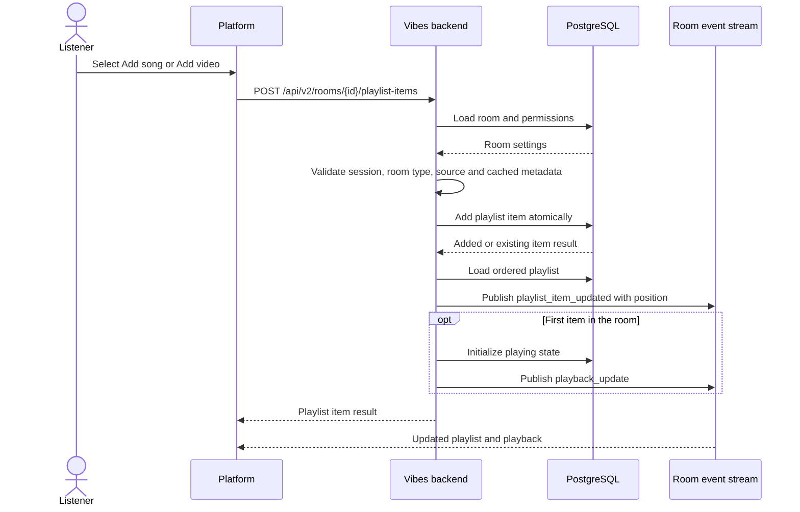
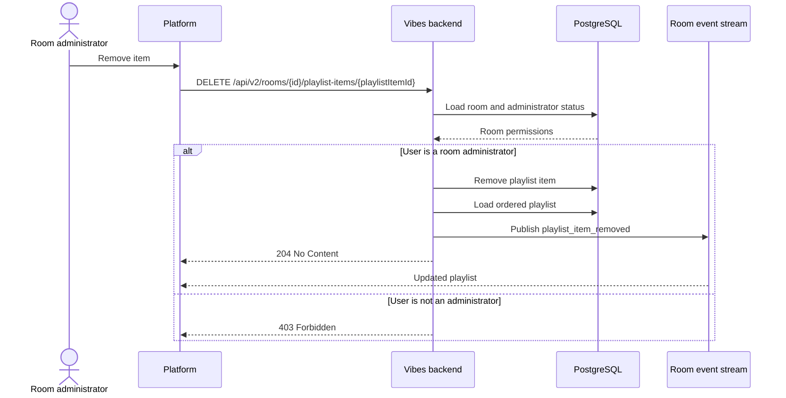
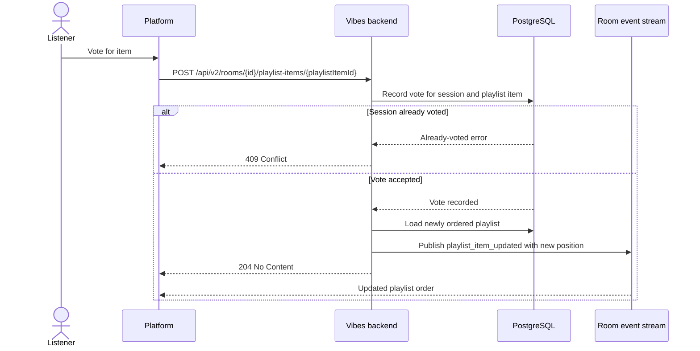

# Playlist Item Operations

## Add an item

The frontend submits normalized metadata returned by an enabled provider. The
backend validates the room type and source before inserting the item. MUSIC
uses song wording in the UI; WATCH uses video wording. Both use the same v2
playlist-item endpoints and v3 events.

Manual additions receive the adding listener's vote. Their queue position is
determined by the database's vote and timestamp ordering, not by appending the
item in the client. The existing ordered-playlist read supplies that position.
The v3 stream receives `playlist_item_updated` with the item and its zero-based
`position`. Clients insert missing items as well as move existing items for this
event. Background imports append unvoted items through `playlist_item_added`.
The v1 `songs_update` and v2 `song_updated`/`song_added` contracts remain supported
through explicit legacy mapping.

```mermaid
sequenceDiagram
    actor Listener
    participant Platform
    participant API as Vibes backend
    participant DB as PostgreSQL
    participant Events as Room event stream

    Listener->>Platform: Select Add song or Add video
    Platform->>API: POST /api/v2/rooms/{id}/playlist-items
    API->>DB: Load room and permissions
    DB-->>API: Room settings
    API->>API: Validate session, room type, source and cached metadata
    API->>DB: Add playlist item atomically
    DB-->>API: Added or existing item result
    API->>DB: Load ordered playlist
    API->>Events: Publish playlist_item_updated with position

    opt First item in the room
        API->>DB: Initialize playing state
        API->>Events: Publish playback_update
    end

    API-->>Platform: Playlist item result
    Events-->>Platform: Updated playlist and playback
```

## Remove an item

Removing an item is restricted to a room administrator.

```mermaid
sequenceDiagram
    actor Admin as Room administrator
    participant Platform
    participant API as Vibes backend
    participant DB as PostgreSQL
    participant Events as Room event stream

    Admin->>Platform: Remove item
    Platform->>API: DELETE /api/v2/rooms/{id}/playlist-items/{playlistItemId}
    API->>DB: Load room and administrator status
    DB-->>API: Room permissions

    alt User is a room administrator
        API->>DB: Remove playlist item
        API->>DB: Load ordered playlist
        API->>Events: Publish playlist_item_removed
        API-->>Platform: 204 No Content
        Events-->>Platform: Updated playlist
    else User is not an administrator
        API-->>Platform: 403 Forbidden
    end
```

## Vote for an item

Each signed session can vote once for a given item. Votes affect playlist order
but do not replace the listener's local player state.

```mermaid
sequenceDiagram
    actor Listener
    participant Platform
    participant API as Vibes backend
    participant DB as PostgreSQL
    participant Events as Room event stream

    Listener->>Platform: Vote for item
    Platform->>API: POST /api/v2/rooms/{id}/playlist-items/{playlistItemId}
    API->>DB: Record vote for session and playlist item

    alt Session already voted
        DB-->>API: Already-voted error
        API-->>Platform: 409 Conflict
    else Vote accepted
        DB-->>API: Vote recorded
        API->>DB: Load newly ordered playlist
        API->>Events: Publish playlist_item_updated with new position
        API-->>Platform: 204 No Content
        Events-->>Platform: Updated playlist order
    end
```
